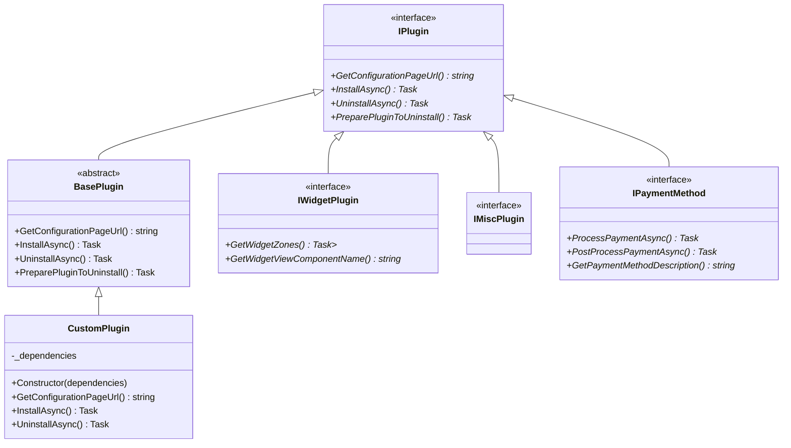
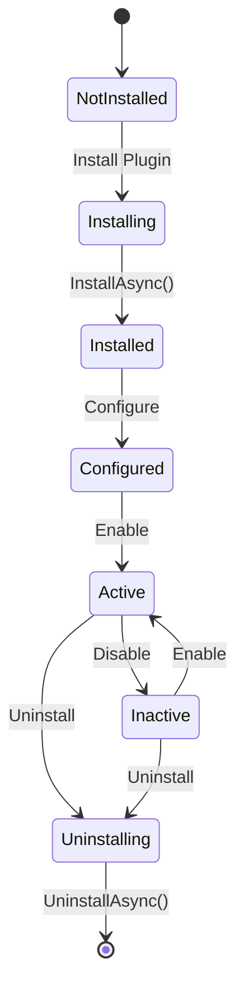
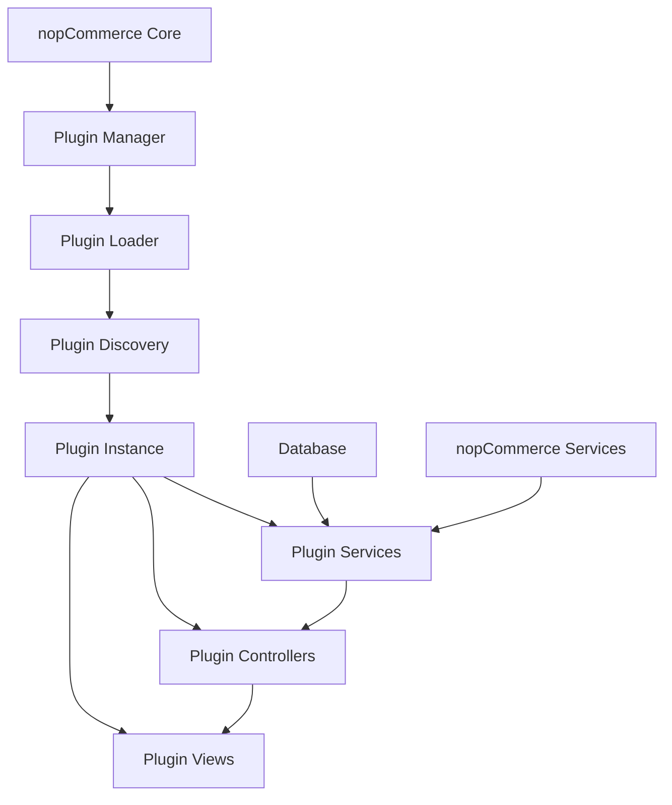
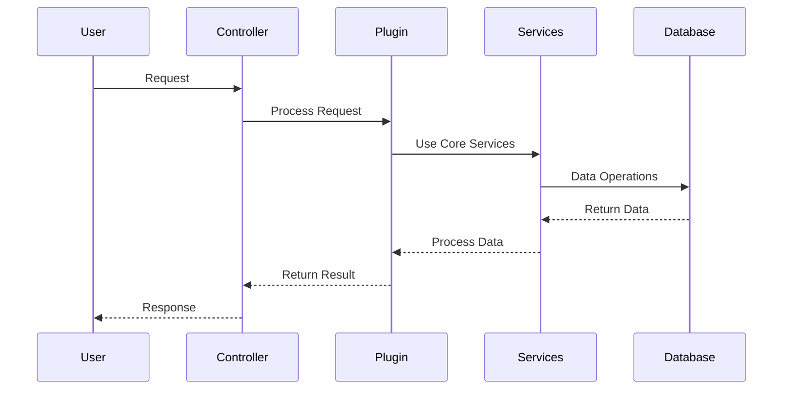
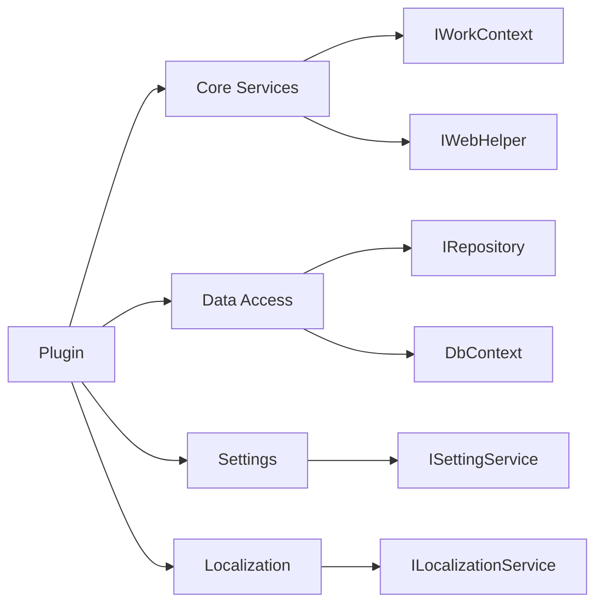

# nopCommerce Plugin Architecture Guide

## Overview
nopCommerce plugins are modular components that extend the core functionality of the platform. Each plugin is a separate project that follows a specific structure and implements certain interfaces to integrate with the main application.

## Plugin Types
nopCommerce supports various types of plugins, each serving different purposes:

1. Widget Plugins (`IWidgetPlugin`)
2. Payment Plugins
3. Shipping Plugins
4. Tax Plugins
5. Authentication Plugins
6. Misc Plugins (`IMiscPlugin`)
7. Exchange Rate Plugins
8. Discovery Plugins
9. External Authentication Plugins

## Basic Plugin Structure

```
Plugin.Name/
├── Controllers/           # MVC Controllers
├── Models/               # View Models
├── Views/                # Razor Views
├── Infrastructure/       # Plugin infrastructure
├── Services/            # Plugin-specific services
├── plugin.json          # Plugin metadata
└── PluginName.cs        # Main plugin class
```

## Core Components

### 1. Main Plugin Class
Every plugin must have a main class that inherits from `BasePlugin` and implements relevant plugin interface:

```csharp
public class MyPlugin : BasePlugin, IPluginInterface
{
    // Constructor with dependency injection
    public MyPlugin(IDependency dependency)
    {
        _dependency = dependency;
    }

    // Required overrides
    public override string GetConfigurationPageUrl()
    {
        // Return configuration page URL if plugin is configurable
    }

    // Installation logic
    public override async Task InstallAsync()
    {
        await base.InstallAsync();
        // Custom installation logic
    }

    // Uninstallation logic
    public override async Task UninstallAsync()
    {
        await base.UninstallAsync();
        // Custom uninstallation logic
    }
}
```

### 2. Plugin Metadata (plugin.json)
Each plugin must include a `plugin.json` file with metadata:

```json
{
  "Group": "Plugin category",
  "FriendlyName": "Display name",
  "SystemName": "Technical.Plugin.Name",
  "Version": "1.0",
  "SupportedVersions": ["4.60"],
  "Author": "Plugin author",
  "DisplayOrder": 1,
  "FileName": "Plugin.Name.dll"
}
```

### 3. Dependencies
Plugins can use dependency injection to access nopCommerce services and infrastructure:

- Core services (`IWebHelper`, `IWorkContext`, etc.)
- Data access (`IRepository<T>`)
- Custom services specific to the plugin

## Plugin Development Guidelines

1. **Separation of Concerns**
   - Keep plugin code modular and focused
   - Use proper layering (presentation, business logic, data access)

2. **Configuration**
   - Implement `GetConfigurationPageUrl()` for configurable plugins
   - Use nopCommerce's settings system for storing configuration

3. **Dependency Injection**
   - Use constructor injection
   - Register plugin-specific services in DI container

4. **Installation/Uninstallation**
   - Override `InstallAsync()` and `UninstallAsync()`
   - Handle database migrations, settings, and localization

5. **Views and UI**
   - Follow nopCommerce's UI conventions
   - Use proper view locations and naming

## Best Practices

1. **Version Compatibility**
   - Specify supported nopCommerce versions
   - Test against target versions

2. **Error Handling**
   - Implement proper exception handling
   - Log errors appropriately

3. **Performance**
   - Optimize database queries
   - Cache when appropriate
   - Minimize resource usage

4. **Security**
   - Validate all inputs
   - Follow security best practices
   - Use proper authorization

5. **Localization**
   - Support multiple languages
   - Use resource files for strings

## UML Diagrams

### 1. Plugin Class Hierarchy


### 2. Plugin Lifecycle


### 3. Plugin Component Interaction


### 4. Plugin Request Flow


### 5. Plugin Dependencies


These diagrams illustrate:
1. The class hierarchy and relationships between different plugin types
2. The lifecycle of a plugin from installation to uninstallation
3. How plugin components interact with each other and the core system
4. The flow of a typical plugin request
5. Common dependencies and services used by plugins

## Common Interfaces

- `IPlugin`: Base interface for all plugins
- `IWidgetPlugin`: For widgets and UI components
- `IPaymentMethod`: For payment gateways
- `IShippingRateComputationMethod`: For shipping providers
- `ITaxProvider`: For tax calculation
- `IMiscPlugin`: For general purpose plugins
- `IExternalAuthenticationMethod`: For authentication providers

## Testing

1. **Unit Testing**
   - Test plugin business logic
   - Mock dependencies

2. **Integration Testing**
   - Test plugin integration with nopCommerce
   - Test database operations

## Deployment

1. **Building**
   - Build plugin against correct nopCommerce version
   - Include all required dependencies

2. **Installation**
   - Copy to proper plugin directory
   - Follow nopCommerce plugin installation guidelines

## Common Pitfalls to Avoid

1. Don't modify core nopCommerce files
2. Don't use hard-coded strings (use localization)
3. Don't ignore async/await patterns
4. Don't store sensitive data in plain text
5. Don't skip proper error handling
