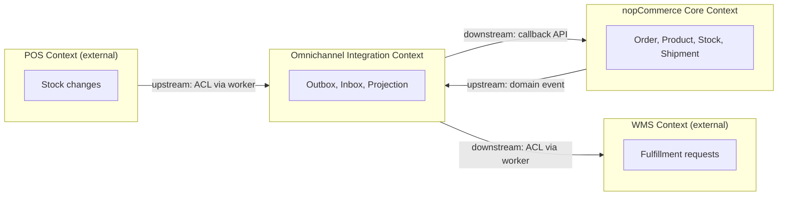
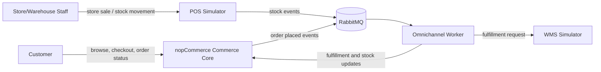
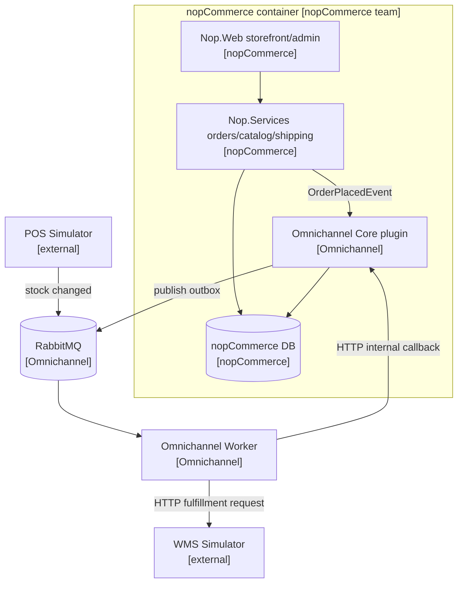
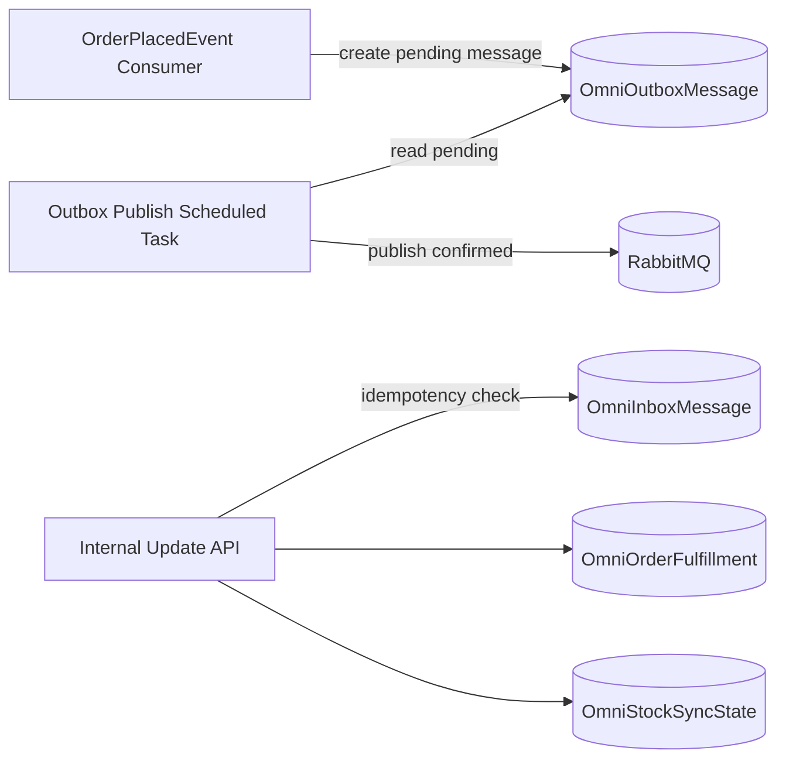
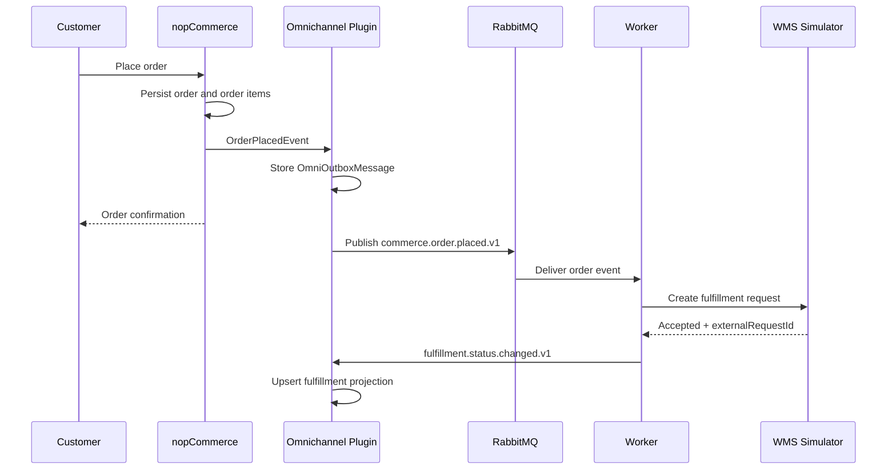
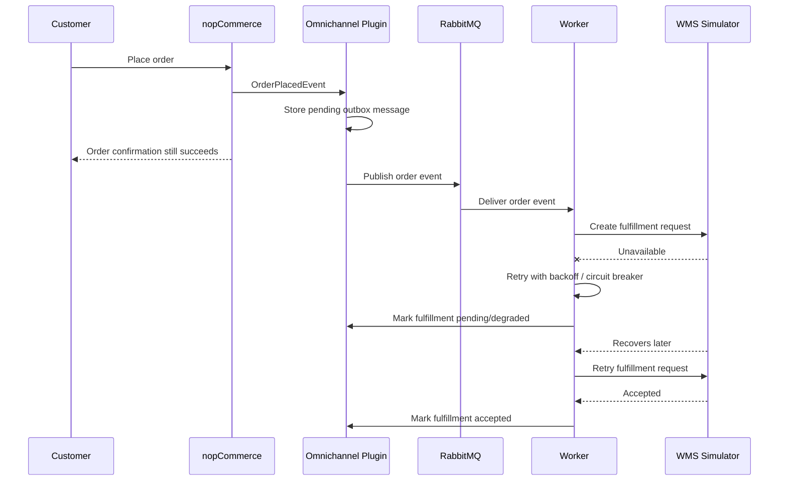
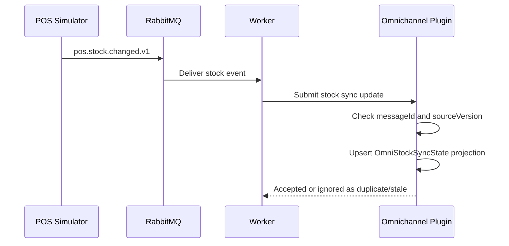

# Part 1 Diagrams

Compact diagrams for the checkpoint. Mermaid format so any Markdown viewer renders them.

## DDD Context Map (bounded contexts + relationships)

- **Upstream** (provider) → **downstream** (consumer) is read in the direction of the arrow.
- The Worker acts as an **anti-corruption layer (ACL)** on the WMS and POS edges: external schemas and quirks are translated into the omnichannel envelope before the plugin sees them.
- nopCommerce Core is upstream of Omnichannel for the order event, but downstream of Omnichannel for fulfillment/stock callbacks — the two contexts have a **customer/supplier** relationship via versioned contracts, not a shared model.

## C4 Level 1 - System Context

## C4 Level 2 - Containers

Owner labels in `[brackets]` show team responsibility (see ADR-0005 for boundary rules).

## C4 Level 3 - Plugin Components

## Runtime - Normal Fulfillment Flow

## Runtime - WMS Unavailable

## Runtime - POS Stock Update

Per ADR-0007, this flow is projection-first. POS updates do not directly write through to nopCommerce core `ProductWarehouseInventory` during the demo; any drift is made visible instead of being silently merged.
