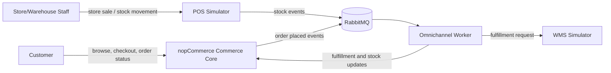
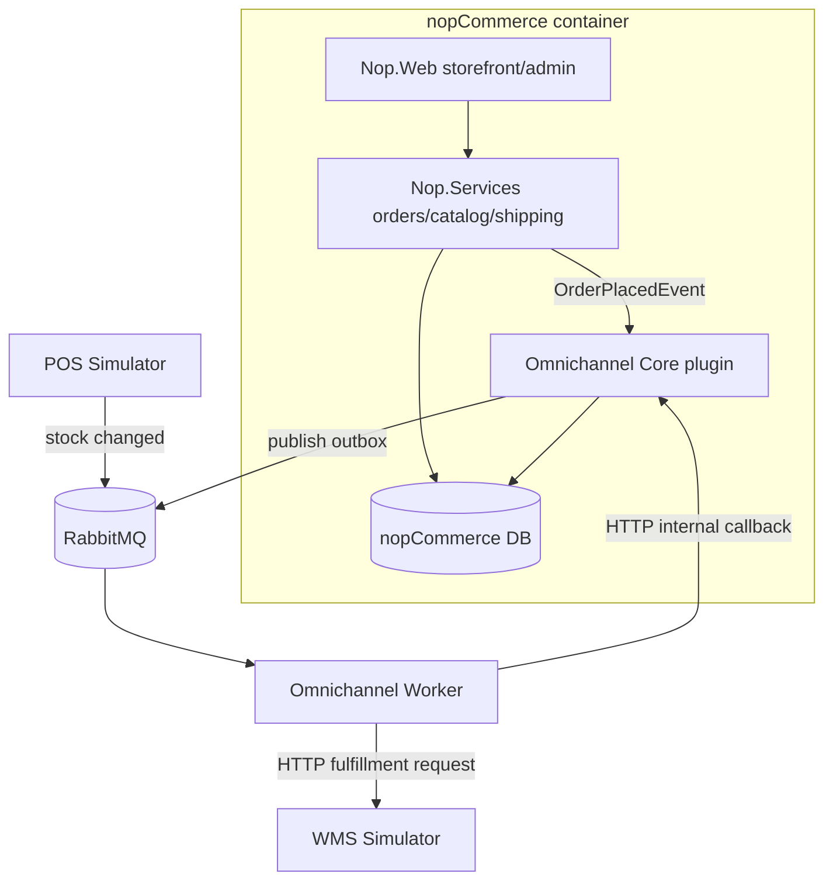
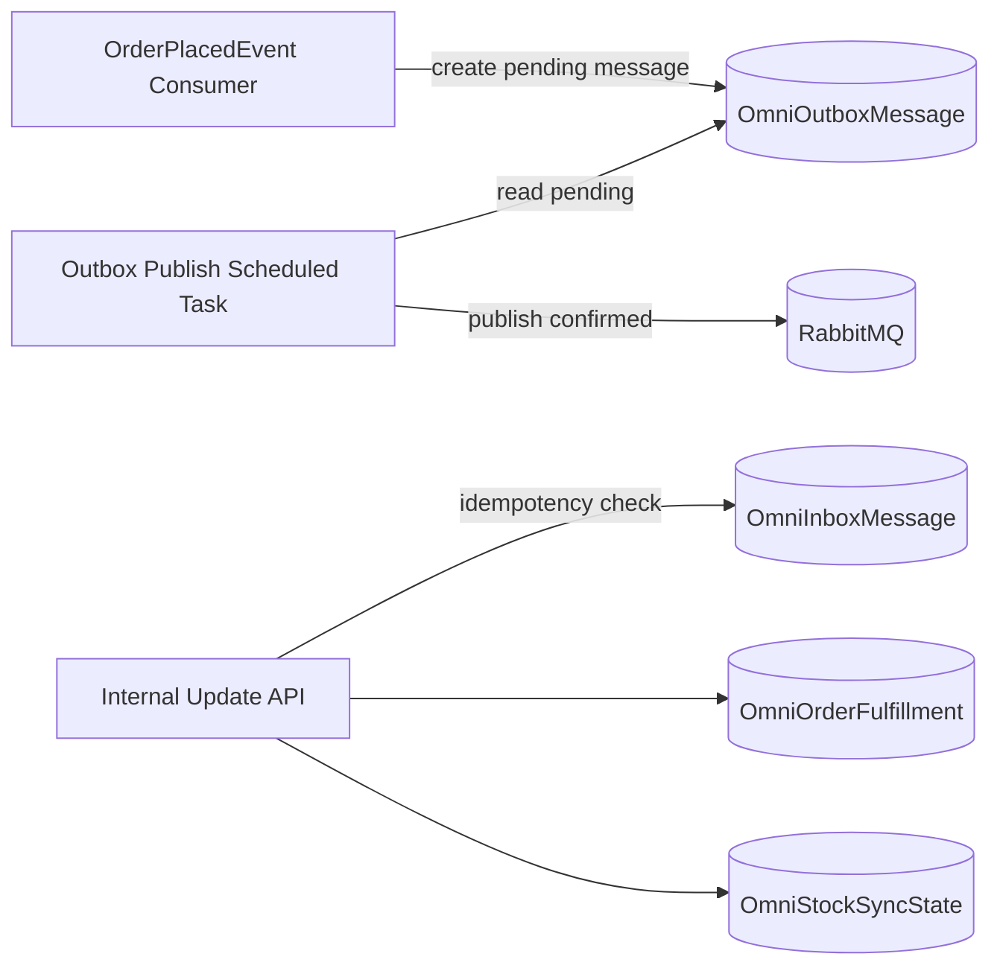
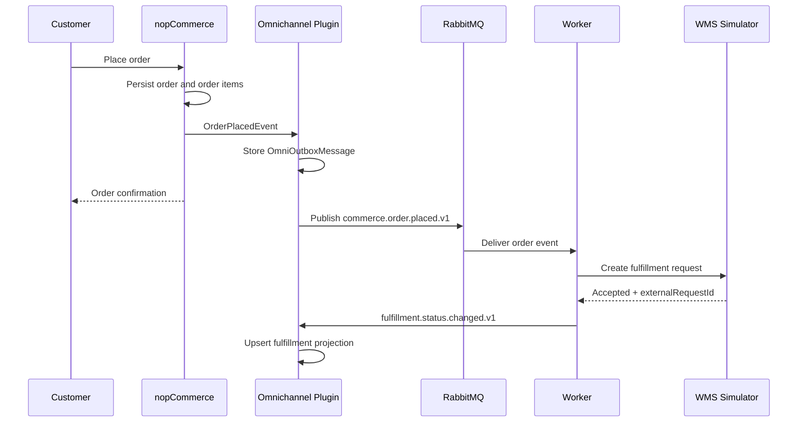
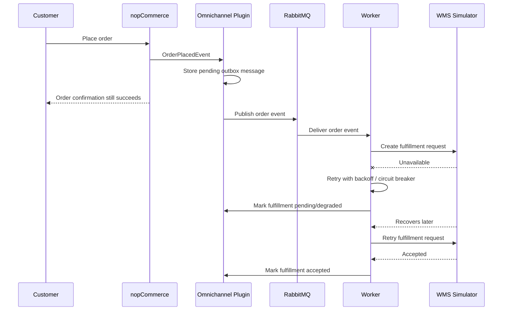
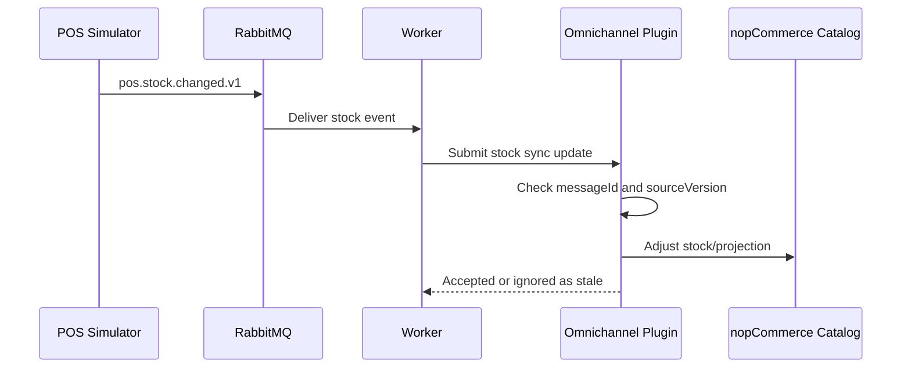

# Part 1 Diagrams

These diagrams are intentionally compact for the 7-minute checkpoint. They are written in Mermaid so they can be rendered by common Markdown viewers.

## C4 Level 1 - System Context

## C4 Level 2 - Containers

## C4 Level 3 - Plugin Components

## Runtime - Normal Fulfillment Flow

## Runtime - WMS Unavailable

## Runtime - POS Stock Update

