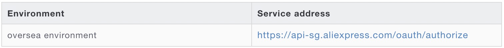
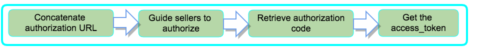
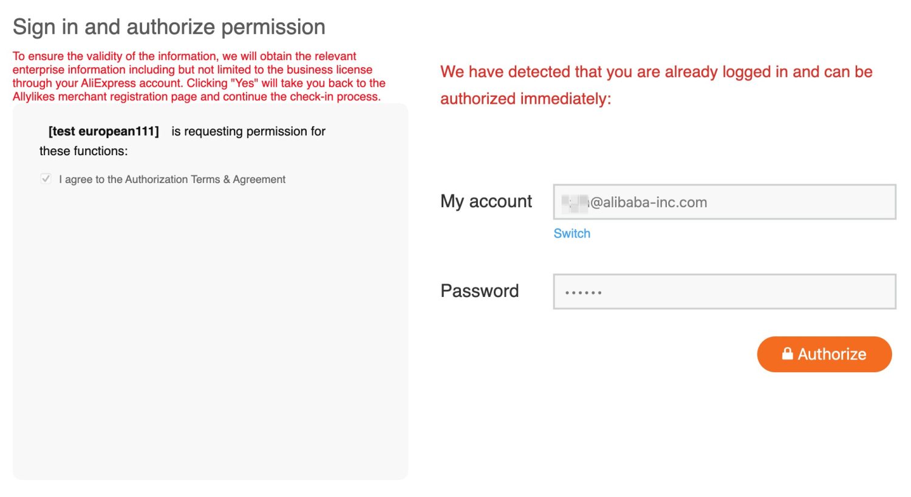
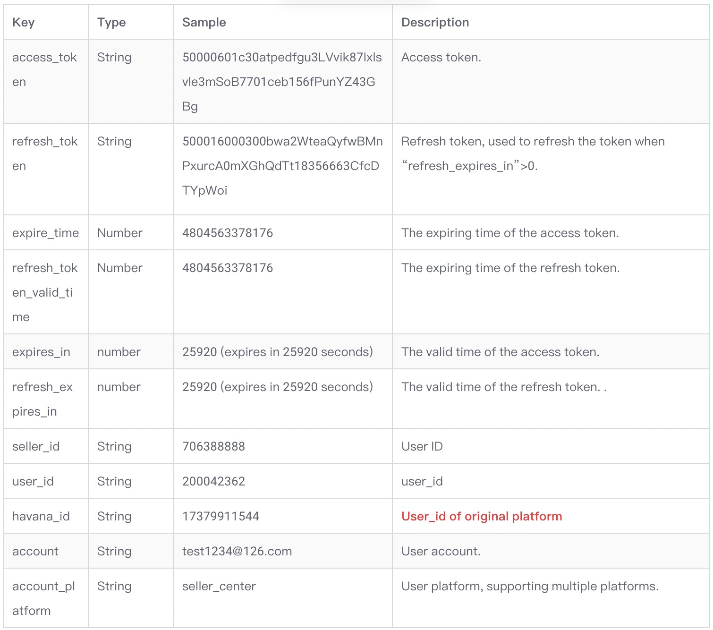

# Aliexpress Seller Authorization

If your application needs to access the business data of Aliexpress sellers (like product and order information) through Aliexpress Open Platform, you need to get the authorization from sellers, that is, the “Access Token” required for accessing the sellers’ data. You need to guide the sellers to complete the flow of “using Aliexpress seller account to log in and authorize the application”. This process uses the international OAuth2.0 standard protocol for user authentication and authorization.

Aliexpress Open Platform adopts the “Code for token” mode, described as follows.

Service address



Authorization steps
The figure below shows the authorization steps:




## 1. Concatenate authorization URL
   Sample link for authorization:

https://api-sg.aliexpress.com/oauth/authorize?response_type=code&force_auth=true&redirect_uri=${app call back url}&client_id=${appkey}

Note that the “client_id” and “redirect_uri” should be replaced with the ones of your own application.

The following table lists the parameters and their description.


## 2. Guide sellers to authorize
   
Guide a seller to open the above authorization URL through the web browser. The following window with the login panel is displayed. The permissions to be granted to the application after the authorization are listed on the left. The seller selects the country, enters seller account and password, and clicks the “Sign in And Authorize” button to complete the authorization of the application.

Note:

Take the following steps to complete the authorization:

1. Authorize using the seller account and password for the MY site.

2. Use the code returned to the callback URL to get the access token.

See the screen capture below.




## 3. Retrieve authorization code
   
After the seller completes the authorization, Aliexpress Open Platform will return the authorization code to the callback URL address. Your application can retrieve the code and use it to get the Access Token. The sample authorization code is shown below.


Note: This authorization code will expire within 30 minutes. You need to use this code to get the access token before it expires.

## 4. Get the access_token
   
### 4.1 Use the `/auth/token/create` API to get the Access Token (access_token),The request example is the way to access the API through the SDK. API documentation：

https://openservice.aliexpress.com/doc/api.htm?spm=a2o9m.11193531.0.0.c6053b53IPZLjr#/api?cid=3&path=/auth/token/create&methodType=GET/POST

Sample code:

```csharp
public static void main(String[] args) {
    String url = "https://api-sg.aliexpress.com";
    String appkey = "your_appkey";
    String appSecret = "your_appSecret";
    String action = "/auth/token/create";
    
    
    IopClient client = new IopClientImpl(url, appkey, appSecret);
    IopRequest request = new IopRequest();
    request.setApiName(action);
    request.addApiParameter("code", "your_code");
    try {
        IopResponse response = client.execute(request, Protocol.GOP);
        System.out.println(JSON.toJSON(response));
        System.out.println(response.getGopResponseBody());
    } catch (Exception e) {
        e.printStackTrace();
    }
}

```
### 4.2 use the HTTP request to get the Access Token (access_token)

HTTP request documentation：

https://openservice.aliexpress.com/doc/doc.htm?spm=a2o9m.11193535.0.0.3d2259b2zcj79W&nodeId=27493&docId=118729#/?docId=1366

## 5. Save the token

The access token will expire in a specific period (expires_in). Before it expires, the seller does not need to authorize the application again. You need to save the latest token properly.

## 6. Sample of the token
   
Notes:

1. The “access_token” and “refresh_token” in this sample are for reference only.

2. For those ISV which migrated from the original open platform,the "user_id" in original open platform corresponds to the "havana_id" here.

```json
{
    "refresh_token_valid_time": 4804563378176,
    "havana_id": "17379911544",
    "expire_time": 4804563378176,
    "locale": "zh_CN",
    "user_nick": "test1234",
    "access_token": "50000000528VP2cqMgQ9h1pUf85GuepqZzuGae1891407feu3qVtfglCKlIW",
    "refresh_token": "50001001928fJIbsqf6eaUuYiFkuhxlrsHiaCr116e71adsfJuZpon3oieGw",
    "user_id": "200042362",
    "account_platform": "seller_center",
    "refresh_expires_in": 3153599922,
    "expires_in": 3153599922,
    "sp": "ae",
    "seller_id": "200042362",
    "account": "test1234@126.com",
    "code": "0",
    "request_id": "212a77bf16509634562801070"
}

```
The following table lists the parameters in the token and their description.




## Refresh authorization steps

1. Use `/auth/token/refresh` to refresh the access token
   The returned data structure by `/auth/token/refresh` is the same with that by getting the access token with authorization code. You will get new “access_token” and “refresh_token”. You must save the latest “refresh_token” for getting the new “access_token”. Note that the duration of the access token will be reset, but the duration of the refresh token will not be reset. After the refresh token expires, sellers need to re-authorize your application to generate new access token and refresh token.

Usage notes
Sellers do not need to authorize again before the token expires.
If `refresh_expires_in` = 0, the access token cannot be refreshed. Only when `refresh_expires_in` > 0, you can call the `/auth/token/refresh` API to refresh the access token.
If token needs to be refreshed, it is recommended to refresh it 30 minutes before the token expires.