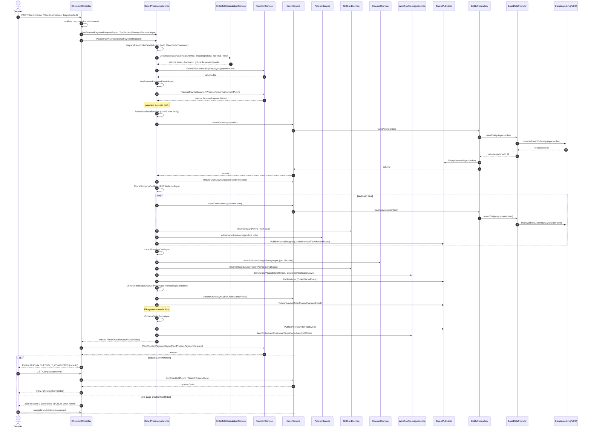

# Research: Analiza przepływu danych w procesie składania zamówień

**Date**: 2026-07-14 (Europe/Warsaw)
**Researcher**: ptomaszewski
**Git Commit**: b4ad2c23a22585b35b387670462694c874292717
**Branch**: develop
**Repository**: nopCommerce

## Research Question

Przeanalizuj proces składania zamówień, zwracając szczególną uwagę na powiązane z nim obszary zdefiniowane w `context/map/repo-map.md`. Wykorzystano trzech równoległych sub-agentów:

1. **Trace e2e** — odtworzenie ścieżki od entry pointu, przez warstwy, do zapisu/odczytu i z powrotem; sekwencja kroków z `file:line` + diagram Mermaid.
2. **Luki w testach** — które metody i gałęzie na tej ścieżce mają pokrycie, a które nie.
3. **Blast radius** — co musi zmienić się razem przy zmianie tego przepływu (szew interfejsu, warstwy generowane, model, migracje, testy); graf statyczny połączony z co-change z historii gita.

Zakres: wyłącznie analiza i opis stanu obecnego repozytorium.

## Summary

Przepływ „złóż zamówienie" jest **klasycznym łańcuchem warstwowego monolitu** opisanym w `repo-map.md`: HTTP → `CheckoutController` (Nop.Web) → `OrderProcessingService.PlaceOrderAsync` (Nop.Services) → `OrderService`/`IRepository<Order>` (Nop.Data) → LinqToDB `INSERT`, a następnie z powrotem przez zdarzenia domenowe, kolejkę e-maili i przekierowanie na stronę „Completed". Oba warianty checkoutu — klasyczny wieloetapowy (`ConfirmOrder`) i one-page (`OpcConfirmOrder`) — zbiegają się w **jednym punkcie**: `PlaceOrderAsync`.

Trzy kluczowe ustalenia:

1. **Feature jest kompletny i spójny architektonicznie** — jedna metoda-orkiestrator (`PlaceOrderAsync`) prowadzi przez walidację, płatność, persystencję, korektę magazynu, historię rabatów/kart podarunkowych, powiadomienia i przeliczenie statusu; efekty uboczne rozgłaszane są przez `IEventPublisher` (rozszerzalność pluginów). **Persystencja to LinqToDB, nie EF Core.**
2. **Ścieżka place-order jest praktycznie nieотестowana.** `PlaceOrderAsync` i wszystkie jego helpery `Prepare*/Validate*/Save*/Move*` mają **zero** bezpośrednich testów; żadna akcja `CheckoutController` nie jest testowana; stub płatności **nie potrafi zwrócić błędu**, więc gałąź „payment declined" jest fizycznie nieosiągalna w obecnym zestawie testów. Brak jakiegokolwiek narzędzia coverage w repo.
3. **Blast radius jest szeroki i częściowo ukryty.** Zmiana modelu `Order` pociąga: domenę, migracje ×3 silniki DB, warstwę serwisów (płatności/podatki/wysyłka/wiadomości/raporty/export), pełny łańcuch Admin `Controller→Factory→Model→View`, mapę Mapster, testy, lokalizację i seed danych. Co-change z historii gita ujawnia **ukryte sprzężenia** (np. `MessageTokenProvider.cs`, `PdfService.cs`, `defaultResources.nopres.xml`), których graf statyczny nie widzi — dokładnie zjawisko „unknown / class-level coupling" z `repo-map.md`.

---

## Feature overview

### Punkt wejścia i warianty

| Wariant | Akcja | Plik:linia | Uwagi |
|---------|-------|------------|-------|
| One-page checkout (domyślny) | `OpcConfirmOrder(bool captchaValid)` | `src/Presentation/Nop.Web/Controllers/CheckoutController.cs:2019` | AJAX, zwraca JSON |
| Klasyczny wieloetapowy | `ConfirmOrder(bool captchaValid)` | `src/Presentation/Nop.Web/Controllers/CheckoutController.cs:1278` | zwraca redirect/View |
| Widok potwierdzenia (GET) | `Confirm()` | `src/Presentation/Nop.Web/Controllers/CheckoutController.cs:1252` | |
| Strona „Completed" | `Completed(int? orderId)` | `src/Presentation/Nop.Web/Controllers/CheckoutController.cs:414` | odczyt zamówienia |

Oba warianty konwergują w `IOrderProcessingService.PlaceOrderAsync` (`src/Libraries/Nop.Services/Orders/IOrderProcessingService.cs:28`, impl. `src/Libraries/Nop.Services/Orders/OrderProcessingService.cs:1594`).

> **Weryfikacja ast-grep (call-site'y `_orderProcessingService.PlaceOrderAsync`):** metoda ma **3** call-site'y, nie 2 — poza storefrontem woła ją także plugin: `CheckoutController.cs:1332` (`ConfirmOrder`), `CheckoutController.cs:2072` (`OpcConfirmOrder`) oraz `src/Plugins/Nop.Plugin.Payments.PayPalCommerce/Services/PayPalCommerceServiceManager.cs:2170`. Konwergencja obu wariantów checkoutu storefrontu pozostaje prawdziwa, ale rdzeń place-order jest osiągalny również spoza `CheckoutController` (ścieżka pluginu PayPal Commerce), co poszerza blast radius.

### Sekwencja end-to-end (od entry pointu do DB i z powrotem)

**A. HTTP entry (Nop.Web)**

1. Akcja `ConfirmOrder`/`OpcConfirmOrder` odbiera POST; waliduje że checkout nie jest wyłączony, ładuje klienta/sklep/koszyk, obsługuje gościa. `CheckoutController.cs:1278` / `:2019`
2. Guard „minimalny odstęp między zamówieniami" — `IsMinimumOrderPlacementIntervalValidAsync(customer)`. `CheckoutController.cs:1313` / `:2053`
3. Budowa/odtworzenie `ProcessPaymentRequest` przez `GetProcessPaymentRequestAsync()`, ustawienie `StoreId`/`CustomerId`/`PaymentMethodSystemName`, zapis przez `SetProcessPaymentRequestAsync`. `CheckoutController.cs:1317-1331` / `:2057-2071`
4. Wywołanie rdzenia: `_orderProcessingService.PlaceOrderAsync(processPaymentRequest)`. `CheckoutController.cs:1332` / `:2072`

**B. Order processing (Nop.Services)**

5. `PlaceOrderAsync` waliduje `OrderGuid`, następnie `PreparePlaceOrderDetailsAsync` buduje `PlaceOrderContainer`. Opcjonalnie całość owinięta w nazwany `Mutex`, gdy `_orderSettings.PlaceOrderWithLock` = true. `OrderProcessingService.cs:1594`, `:1602`→def `:288`, mutex `:1679-1718`
6. `PreparePlaceOrderDetailsAsync` sekwencyjnie waliduje: klienta (`:564`), koszyk + atrybuty checkoutu (`:489`), adres rozliczeniowy (`:540`), dane wysyłki (`:426`), sumy (`:345`). `OrderProcessingService.cs:288-315`
   - `PrepareAndValidateTotalsAsync` liczy subtotal/shipping/tax/total przez `IOrderTotalCalculationService`: `GetShoppingCartSubTotalsAsync` (`:349`), `GetShoppingCartShippingTotalsAsync` (`:367`), `GetTaxTotalAsync` (`:388`), `GetShoppingCartTotalAsync` (`:399`); opłata za metodę płatności przez `_paymentService.GetAdditionalHandlingFeeAsync` (`:382`).
7. Płatność: `GetProcessPaymentResultAsync` (`:1611`→def `:1395`) ładuje aktywny plugin (`_paymentPluginManager.LoadPluginBySystemNameAsync`, `:1403`) i wywołuje `_paymentService.ProcessPaymentAsync` (`:1424`) lub `ProcessRecurringPaymentAsync` (`:1418`); przy zerowej sumie zwraca syntetyczny wynik `Paid` (`:1428`).
8. Persystencja nagłówka: `SaveOrderDetailsAsync` (`:1616`→def `:723`) buduje encję `Order`, wstawia adresy przez `_addressService.InsertAddressAsync`, następnie `_orderService.InsertOrderAsync(order)` (`:800`), generuje custom order number i `UpdateOrderAsync` (`:803-804`).
9. Pozycje zamówienia: `MoveShoppingCartItemsToOrderItemsAsync` (`:1621`→def `:1283`) — per pozycja: liczy ceny, `_orderService.InsertOrderItemAsync` (`:1334`), karty podarunkowe `AddGiftCardsAsync` (`:1337`), **korekta magazynu** `_productService.AdjustInventoryAsync(product, -qty, ...)` (`:1340`), publikacja `ShoppingCartItemMovedToOrderItemEvent` (`:1343`); po pętli `ClearShoppingCartAsync` (`:1346`).
10. Historia użycia rabatów `SaveDiscountUsageHistoryAsync` (`:1624`→def `:1461`) i kart podarunkowych `SaveGiftCardUsageHistoryAsync` (`:1627`→def `:1438`).
11. Płatność cykliczna (jeśli koszyk recurring): `CreateFirstRecurringPaymentAsync` (`:1630-1631`).
12. Powiadomienia + notatki: `SendNotificationsAndSaveNotesAsync` (`:1634`→def `:824`) — notatka „Order placed", e-maile przez `IWorkflowMessageService.SendOrderPlaced*NotificationAsync` (`:832`, `:840`), opcjonalnie PDF faktury (`:837`).
13. Reset danych checkoutu `ResetCheckoutDataAsync` (`:1637`) + log aktywności `PublicStore.PlaceOrder` (`:1639`).
14. Zdarzenie domenowe `OrderPlacedEvent` (`:1644`).
15. Przeliczenie statusu `CheckOrderStatusAsync` (`:1647`→def `:1581`→`CheckAndSaveOrderStatusAsync` `:1487`): Pending→Processing→Complete, `SetOrderStatusAsync` zapisuje i publikuje `OrderStatusChangedEvent`.
16. Jeśli `PaymentStatus == Paid`: `ProcessOrderPaidAsync` (`:1650`→def `:1107`) publikuje `OrderPaidEvent` (`:1112`), kolejkuje e-maile „paid", aktualizuje role klienta.
17. Zwrot `PlaceOrderResult` (z `PlacedOrder`), błędy logowane i agregowane. `:1667-1676`

**C. Persystencja (Nop.Services → Nop.Data → LinqToDB)**

18. `OrderService.InsertOrderAsync` → `_orderRepository.InsertAsync(order)`. `src/Libraries/Nop.Services/Orders/OrderService.cs:357-360`; `InsertOrderItemAsync` → `_orderItemRepository.InsertAsync` `:748-751`.
19. `EntityRepository<TEntity>.InsertAsync` → `_dataProvider.InsertEntityAsync(entity)` + `EntityInsertedAsync` (inwalidacja cache / event). `src/Libraries/Nop.Data/EntityRepository.cs:340-349`
20. **Fizyczny zapis:** `BaseDataProvider.InsertEntityAsync<TEntity>` otwiera LinqToDB `DataConnection` i wykonuje `InsertWithInt32IdentityAsync(entity)` (SQL Server / MySQL / PostgreSQL). `src/Libraries/Nop.Data/DataProviders/BaseDataProvider.cs:233-238` (zapis `:236`)

**D. Powrót do przeglądarki**

21. `PlaceOrderResult` wraca do akcji kontrolera (`CheckoutController.cs:1332` / `:2072`).
22. Post-process płatności: `_paymentService.PostProcessPaymentAsync` (`:1341` / `:2100`) — dla metod redirection zwraca JSON z `redirect` (`:2094`).
23. Odpowiedź HTTP:
    - Klasyczny: `RedirectToRoute(CHECKOUT_COMPLETED, new { orderId })` (`:1349`), przy błędzie re-render `View(model)` z ostrzeżeniami (`:1352-1362`).
    - OPC: `Json(new { success = 1 })` (`:2086` / `:2102`), błąd → re-render partiala `Json(update_section...)` (`:2112-2120`) lub `Json(new { error = 1, message })` (`:2125`).
24. Strona „Completed" (`:414`): odczyt zamówienia `GetOrderByIdAsync` (`:425`) / fallback `SearchOrdersAsync` (`:430`), walidacja własności, `View` z modelu `PrepareCheckoutCompletedModelAsync`.

### Diagram sekwencji (Mermaid)

### Efekty uboczne / punkty rozszerzeń

- **Zdarzenia domenowe** (dla pluginów `IConsumer<T>`): `ShoppingCartItemMovedToOrderItemEvent`, `OrderPlacedEvent`, `OrderStatusChangedEvent`, `OrderPaidEvent`, plus generyczne `EntityInsertedAsync`/`EntityUpdatedAsync` z repozytorium.
- **E-maile** są *kolejkowane* (`QueuedEmail`), nie wysyłane synchronicznie — realną wysyłkę robi zadanie w tle.
- **Magazyn** korygowany w trakcie place-order (`AdjustInventoryAsync`) z historią `StockQuantityHistory` i ewentualnymi powiadomieniami o niskim stanie.

---

## Technical debt

Uporządkowane wg ryzyka (najwyższe u góry).

### 1. Krytyczny brak testów najważniejszej ścieżki (high)

- `PlaceOrderAsync` (`OrderProcessingService.cs:1594`) oraz **wszystkie** helpery `PreparePlaceOrderDetailsAsync` (`:288`), `PrepareAndValidateCustomerAsync` (`:564`), `PrepareAndValidateShoppingCartAndCheckoutAttributesAsync` (`:489`), `PrepareAndValidateBillingAddressAsync` (`:540`), `PrepareAndValidateShippingInfoAsync` (`:426`), `PrepareAndValidateTotalsAsync` (`:345`), `GetProcessPaymentResultAsync` (`:1395`), `SaveOrderDetailsAsync` (`:723`), `MoveShoppingCartItemsToOrderItemsAsync` (`:1283`) — **zero bezpośrednich testów**.
- Żadna akcja `CheckoutController` (`Confirm`, `ConfirmOrder`, `OpcConfirmOrder`, `OpcCompleteRedirectionPayment`) nie ma testu — brak w ogóle projektu testów prezentacji/kontrolerów.
- Gałęzie nieпokryte przez żaden test: niewystarczający stan magazynu, **płatność odrzucona** (`:1652-1659`), walidacja minimalnego subtotal/total (`:519`, `:526`; metody `ValidateMinOrderSubtotalAmountAsync` `:3190`, `ValidateMinOrderTotalAmountAsync` `:3215`), rzuty „Shipping/Order total couldn't be calculated" (`:370`, `:401`), przypadki brzegowe rabatów/kart/punktów, oraz **guard współbieżności `PlaceOrderWithLock`/mutex + `MinimumOrderPlacementInterval`** (`:1679-1716`) — mechanizm chroniący przed podwójnym obciążeniem, w całości bez testu.
- **Co jest przetestowane:** wyłącznie *maszyna stanów po zamówieniu* — guardy `CanCancelOrder`/`CanCaptureAsync`/`CanRefundAsync`/`CanVoidAsync` itd. (`OrderProcessingServiceTests.cs:52-492`) i matematyka płatności cyklicznych (`:496-697`); `OrderTotalCalculationServiceTests.cs` dobrze pokrywa *obliczenia* sum/podatków/rabatów, ale nie ich integrację w place-order.

**Why:** krytyczny przepływ obsługujący pieniądze i magazyn nie ma siatki bezpieczeństwa; regresja w walidacji sum, płatności lub współbieżności przejdzie niezauważona.
**How to apply:** przy każdej zmianie w `OrderProcessingService` zakładać, że nie ma testu chroniącego — dopisywać testy razem ze zmianą; priorytetem gałęzie „payment declined", min-order i mutex.

### 2. Stub płatności nie potrafi zawieść — gałąź „declined" nieosiągalna (high)

- `TestPaymentMethod.ProcessPaymentAsync` (`src/Tests/.../TestPaymentMethod.cs:103-111`) **zawsze** zwraca `NewPaymentStatus = Paid`, bez błędu i bez przełącznika awarii. W efekcie nawet test integracyjny nie mógłby dziś przejść ścieżką odrzuconej płatności bez dopisania nowego stuba.

**Why:** najbardziej ryzykowna finansowo gałąź (nieudana płatność) jest strukturalnie nietestowalna obecnym narzędziem.
**How to apply:** zanim testować „payment declined", rozszerzyć stub o konfigurowalny wynik (`Success=false` + errors).

### 3. Brak jakiegokolwiek narzędzia coverage (medium)

- Brak `.runsettings`, brak coverlet/dotnet-coverage w `Nop.Tests.csproj`, brak flag `--collect` w CI (`.github/workflows/dotnet.yml`). Nie istnieje autorytatywna liczba pokrycia — jedyna dostępna ocena to ręczne mapowanie test→kod.

**Why:** regresje pokrycia nie są wykrywane automatycznie; „nietestowane" łatwo mylone z „przetestowane".
**How to apply:** rozważyć dodanie `XPlat Code Coverage` w CI jako pierwszy krok zanim rozbudowywać testy place-order.

### 4. Ukryte (implicit) sprzężenie modelu Order — pułapka blast-radius (high)

Pliki o wysokim co-change, ale **bez statycznej referencji przez serwisy zamówień** — zmiana nazwy/semantyki pola `Order` nie wywoła błędu kompilacji na tej ścieżce:

- `src/Libraries/Nop.Services/Messages/MessageTokenProvider.cs` (~128 odwołań `Order.`, co-change 71) — buduje tokeny e-mail po nazwach pól.
- `src/Libraries/Nop.Services/Common/PdfService.cs` (co-change 56) — czyta pola `Order` do faktury PDF.
- `src/Presentation/Nop.Web/App_Data/Localization/defaultResources.nopres.xml` (co-change 47) — czysta lokalizacja, zero referencji w kodzie, wysokie ryzyko konfliktów merge.
- `Installation/InstallRequiredData.cs` (dawniej `CodeFirstInstallationService.cs`, co-change 57) — „wspólny mianownik" repo; sprzężenie przez seed danych/domyślne `OrderSettings`, nie przez kod.

**Why:** to dokładnie zjawisko „unknown / class-level coupling" z `repo-map.md` — graf statyczny `.csproj` tego nie widzi; zmiana pola `Order` może po cichu zepsuć e-maile, PDF i seed.
**How to apply:** przy zmianie modelu `Order` ręcznie sprawdzić te 4 pliki (kompilator nie ostrzeże); dla lokalizacji planować równolegle wpis w `defaultResources.nopres.xml`.

### 5. Szeroki, wielowarstwowy blast radius kontraktu Order (medium)

Zmiana modelu/kontraktu `Order` wymaga skoordynowanej zmiany w:

- **Domena:** `Order.cs` + rodzeństwo `OrderItem/OrderNote/RecurringPayment/GiftCard` + eventy `Order*Event.cs` (`src/Libraries/Nop.Core/Domain/Orders/`).
- **Migracje/schemat (×3 silniki DB):** `Mapping/Builders/Orders/OrderBuilder.cs:13-30`, nowa migracja `UpgradeToXXX`, `Migrations/Installation/SchemaMigration.cs`, `Indexes.cs`.
- **Serwisy:** `IOrderService`/`OrderService`, `IOrderProcessingService`/`OrderProcessingService`, `OrderTotalCalculationService`, `ShoppingCartService`, `OrderReportService`; konsumenci `ShippingService`/`ShipmentService`, `ExportManager`/`ImportManager`, `PdfService`, `MessageTokenProvider`/`WorkflowMessageService`.
- **Admin UI (pełny łańcuch Controller→Factory→Model→View):** `Areas/Admin/Controllers/OrderController.cs` → `Factories/OrderModelFactory.cs` → modele `Models/Orders/*` (folder liczy **54** pliki, z czego **16** z prefiksem `Order*` — zweryfikowane) → **18** widoków `Views/Order/*` (dokładnie) → `Validators/Orders/OrderAddressValidator.cs`.
- **Storefront UI:** `CheckoutController.cs`, `Controllers/OrderController.cs`, `Factories/OrderModelFactory.cs`.
- **Mapowanie (Mapster):** `Areas/Admin/Infrastructure/Mapper/AdminMapperConfiguration.cs` (po migracji z AutoMapper na Mapster, commit #7673). **Korekta ast-grep:** mapy encji `Order` są **rozproszone**, nie skupione w jednej metodzie:
  - `CreateMap<Order, AffiliatedOrderModel>()` — `:242`, leży **poza** `CreateOrdersMaps()` (metoda zaczyna się dopiero `:1265`);
  - `CreateMap<Order, CustomerOrderModel>()` — `:1267`, wewnątrz `CreateOrdersMaps()`;
  - cytowana wcześniej `:1038` to mapa `DiscountUsageHistory`, **nie** `Order`;
  - **brak** w ogóle mapy `CreateMap<Order, OrderModel>` — główny `OrderModel` budowany jest ręcznie w `OrderModelFactory`, nie przez Mapster.
  Wniosek: `CreateOrdersMaps()` **nie jest jedyną** lokalizacją map `Order↔Model` — przy zmianie kontraktu `Order` trzeba sprawdzić także mapę `:242` poza tą metodą.
- **Testy:** `OrderProcessingServiceTests.cs`, `OrderServiceTests.cs`, `Nop.Data.Tests/Orders/OrderPersistenceTests.cs`, `Nop.Web.Tests/Admin/Infrastructure/AdminMapperConfigurationTest.cs`.
- **Lokalizacja / seed / uprawnienia:** `defaultResources.nopres.xml`, `InstallRequiredData.cs`.

**Why:** liniowy DAG warstw oznacza przewidywalny, ale długi łańcuch zmian; pominięcie jednego ogniwa (zwłaszcza migracji ×3 lub mapy Mapster) daje błąd runtime/build zamiast lokalnego.
**How to apply:** traktować powyższą listę jak checklistę przy każdej zmianie kontraktu Order.

### 6. „God method" `PlaceOrderAsync` (medium/low)

- Jedna metoda orkiestruje ~kilkanaście odpowiedzialności (walidacja, płatność, persystencja, magazyn, historia rabatów/kart, powiadomienia, statusy, role) z zagnieżdżoną domknięciem lokalną funkcją `placeOrder` i opcjonalnym mutexem (`OrderProcessingService.cs:1594-1718`). Wysoka złożoność + brak testów (pkt 1) czyni ją najtrudniejszym do bezpiecznej zmiany miejscem przepływu.

**Why:** duża powierzchnia, wiele efektów ubocznych, transakcyjność rozproszona po wielu serwisach — łatwo o częściowy stan przy wyjątku.
**How to apply:** zmiany wprowadzać punktowo w wydzielonych helperach `Prepare*/Save*`, nie w ciele orkiestratora; najpierw dopisać test charakteryzujący.

---

## Code References

- `src/Presentation/Nop.Web/Controllers/CheckoutController.cs:1278` — `ConfirmOrder` (klasyczny entry point)
- `src/Presentation/Nop.Web/Controllers/CheckoutController.cs:2019` — `OpcConfirmOrder` (one-page entry point)
- `src/Presentation/Nop.Web/Controllers/CheckoutController.cs:414` — `Completed` (odczyt zamówienia, powrót)
- `src/Libraries/Nop.Services/Orders/OrderProcessingService.cs:1594` — `PlaceOrderAsync` (rdzeń orkiestracji)
- `src/Libraries/Nop.Services/Orders/OrderProcessingService.cs:288` — `PreparePlaceOrderDetailsAsync`
- `src/Libraries/Nop.Services/Orders/OrderProcessingService.cs:723` — `SaveOrderDetailsAsync`
- `src/Libraries/Nop.Services/Orders/OrderProcessingService.cs:1283` — `MoveShoppingCartItemsToOrderItemsAsync`
- `src/Libraries/Nop.Services/Orders/OrderProcessingService.cs:1679-1718` — `PlaceOrderWithLock` / mutex
- `src/Libraries/Nop.Services/Orders/OrderService.cs:357` / `:748` — `InsertOrderAsync` / `InsertOrderItemAsync`
- `src/Libraries/Nop.Data/EntityRepository.cs:340` — generyczny `InsertAsync` + event
- `src/Libraries/Nop.Data/DataProviders/BaseDataProvider.cs:233-236` — fizyczny zapis LinqToDB (SQL Server / MySQL)
- `src/Libraries/Nop.Data/DataProviders/PostgreSqlDataProvider.cs:297-302` — **override** `InsertEntityAsync` dla PostgreSQL (osobna ścieżka zapisu)
- `src/Libraries/Nop.Core/Domain/Orders/Order.cs` — encja domenowa
- `src/Libraries/Nop.Data/Mapping/Builders/Orders/OrderBuilder.cs:13-30` — schemat/kolumny/FK
- `src/Presentation/Nop.Web/Areas/Admin/Infrastructure/Mapper/AdminMapperConfiguration.cs:1265` — `CreateOrdersMaps()` (Mapster); mapa `Order→CustomerOrderModel` `:1267`
- `src/Presentation/Nop.Web/Areas/Admin/Infrastructure/Mapper/AdminMapperConfiguration.cs:242` — `CreateMap<Order, AffiliatedOrderModel>()` (mapa `Order` **poza** `CreateOrdersMaps()`)
- `src/Plugins/Nop.Plugin.Payments.PayPalCommerce/Services/PayPalCommerceServiceManager.cs:2170` — 3. call-site `PlaceOrderAsync` (poza `CheckoutController`)
- `src/Tests/Nop.Tests/Nop.Services.Tests/Orders/OrderProcessingServiceTests.cs:52-697` — testy guardów statusu + recurring (jedyne pokrycie)
- `src/Tests/Nop.Tests/Nop.Services.Tests/Orders/OrderTotalCalculationServiceTests.cs` — testy obliczeń sum
- `src/Tests/Nop.Tests/Nop.Services.Tests/Payments/TestPaymentMethod.cs:103-111` — stub płatności (`ProcessPaymentAsync` zawsze `NewPaymentStatus = Paid`, `:107`; to jedyna lokalizacja pliku — poprzednia ścieżka `src/Plugins/...` była błędna)

## Architecture Insights

- **Konwergencja wariantów:** dwa różne UX checkoutu (klasyczny + OPC) używają jednego serwisu rdzeniowego — dobra kohezja logiki, ryzyko skupione w jednym punkcie.
- **Persystencja = LinqToDB, nie EF Core** — zapis przez `InsertWithInt32IdentityAsync`. **Korekta ast-grep:** ścieżka **nie jest w pełni jednolita** — SQL Server i MySQL używają bazowej `BaseDataProvider.InsertEntityAsync` (`:233-236`), natomiast `PostgreSqlDataProvider` **nadpisuje** tę metodę własną implementacją (`:297-302`, dodatkowa obsługa FK). Oba warianty finalnie wołają `InsertWithInt32IdentityAsync`, ale różnymi metodami — przy zmianie logiki insertu trzeba dotknąć obu miejsc. Każda zmiana schematu = migracja świadoma 3 silników (zgodne z „Strefy ryzyka" w `repo-map.md`).
- **Rozszerzalność przez zdarzenia:** efekty uboczne (`OrderPlacedEvent`, `OrderPaidEvent`, `EntityInserted`) to kontrakt dla pluginów — pluginy nie odwołują się do `Nop.Services`, konsumują eventy (zgodne z „Pluginy → tylko prezentacja").
- **Sprzężenie przez nazwy pól** (`MessageTokenProvider`, `PdfService`, lokalizacja) — klasyczny „unknown coupling" z mapy; kompilator nie chroni.
- **Wzorzec Controller→Factory→Model→View** potwierdzony w Admin Order — zmiana pola pociąga cały łańcuch.

## Historical Context (from prior changes)

- `context/map/repo-map.md` — mapa onboardingowa: potwierdza, że `Nop.Services/Orders` to gorący obszar (Orders = 54 dotknięć), `InstallRequiredData.cs` to „wspólny mianownik", oraz że graf statyczny **nie widzi** sprzężeń klas/namespace („unknown", sekcja 3 i 7). Niniejszy research uzupełnia tę lukę danymi co-change dla przepływu zamówień.
- Migracja AutoMapper → Mapster (commit `99997cecd6`, `#7673`) — dlatego jedyną mapą Order↔Model jest dziś `AdminMapperConfiguration.CreateOrdersMaps()` (Mapster), a nie profile AutoMapper.

## Related Research

- Brak wcześniejszych artefaktów `research.md` w `context/changes/**/` i `context/archive/**/` (to pierwszy research w tym repozytorium).

## Weryfikacja strukturalna (ast-grep)

Twierdzenia strukturalne raportu (liczby call-site'ów, „tylko tutaj", „zawsze przez X", liczność metod, powtarzalne kształty wywołań) zweryfikowano narzędziem **ast-grep 0.44.1** (`-l cs`), każde zero potwierdzając klasycznym `grep`.

| Twierdzenie | Werdykt | Ustalenie |
|---|---|---|
| `PlaceOrderAsync` — konwergencja w jednym punkcie (2 call-site'y) | **doprecyzowane** | 3 call-site'y: `CheckoutController.cs:1332`, `:2072`, `PayPalCommerceServiceManager.cs:2170` |
| `CreateOrdersMaps()` = jedyna mapa `Order↔Model` | **obalone** | mapa `Order→AffiliatedOrderModel` `:242` poza metodą; `:1038` to mapa `DiscountUsageHistory`; brak `Order→OrderModel` |
| `MessageTokenProvider` ~128 odwołań `Order.` | **potwierdzone** | dokładnie 128 |
| ~15 modeli `Models/Orders/*` | **doprecyzowane** | folder = 54 pliki; `Order*` = 16 |
| 18 widoków `Views/Order/*` | **potwierdzone** | dokładnie 18 |
| Helpery `Prepare*/Validate*/Save*/Move*/GetProcessPaymentResult` na cytowanych liniach | **potwierdzone** | wszystkie 13 def. na dokładnych liniach + `PlaceOrderAsync:1594` |
| `AdjustInventoryAsync(product, -qty, …)` `:1340` | **potwierdzone** | `-sc.Quantity` |
| `TestPaymentMethod` zawsze `Paid` | **potwierdzone** | `:107`; ścieżka poprawiona na `src/Tests/...` |
| Jednolita ścieżka zapisu `InsertWithInt32IdentityAsync` (SQL/MySQL/PG) | **doprecyzowane** | PostgreSQL nadpisuje `InsertEntityAsync` (`:297-302`) |
| 4 zdarzenia domenowe publikowane | **potwierdzone** | `:1025`, `:1112`, `:1343`, `:1644` (+ reorder `:2005`) |
| Akcje kontrolera `:414/:1252/:1278/:2019` | **potwierdzone** | wszystkie 4 |
| Zero bezpośrednich testów `PlaceOrderAsync` | **potwierdzone** | brak referencji w `src/Tests` (grep = NONE) |
| `OrderBuilder.cs:13-30` — schemat/FK | **potwierdzone** | `MapEntity` w zakresie |

## Open Questions

1. Czy `PlaceOrderAsync` gwarantuje atomowość zapisów (order + items + inventory + histories)? Brak widocznej jawnej transakcji DB wokół całości — przy wyjątku w połowie możliwy częściowy stan. Wymaga weryfikacji, czy LinqToDB/`DataConnection` obejmuje to ambientową transakcją.
2. Jak dokładnie działa guard `MinimumOrderPlacementInterval` względem cache (`:1691-1710`) w środowisku wieloinstancyjnym (distributed cache vs in-memory)?
3. Które pluginy płatności faktycznie implementują `PaymentMethodType.Redirection` i jak to wpływa na gałąź OPC `OpcCompleteRedirectionPayment` (`:2129`)?
4. Czy istnieją testy `OrderPersistenceTests.cs` w `Nop.Data.Tests` i co dokładnie asertują (pojawiły się w co-change Order.cs 14×, ale nie w analizie pokrycia ścieżki place-order)?
