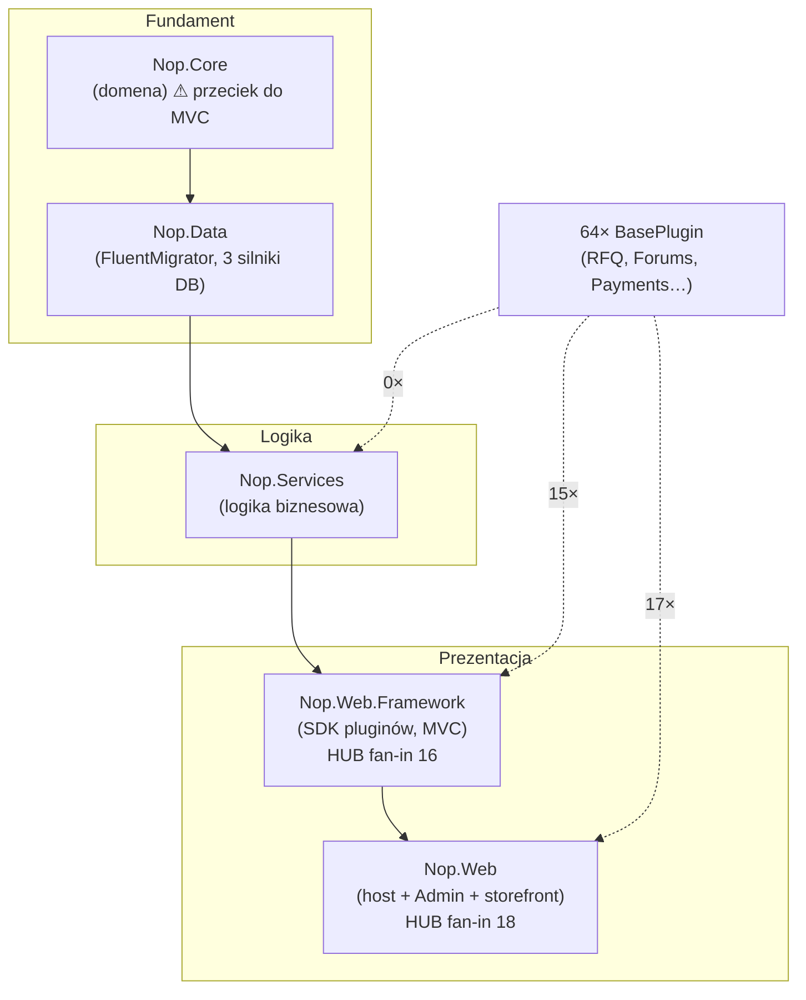
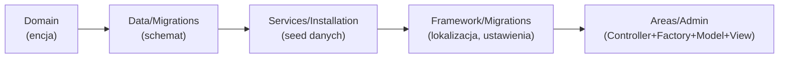

# Mapa projektu — nopCommerce (onboarding)

> Dokument wprowadzający dla nowego developera. Synteza trzech raportów roboczych:
> [`artifact-1-territory.md`](artifact-1-territory.md) (historia gita) · [`artifact-2-structure.md`](artifact-2-structure.md) (graf zależności) · [`artifact-3-contributors.md`](artifact-3-contributors.md) (kontrybutorzy).
> **Okno analizy: ostatnie 12 miesięcy (2025-07 → 2026-07).** To mapa *aktywności i struktury*, nie kompletnej funkcjonalności — patrz [Ograniczenia](#7-ograniczenia).

## 1. TL;DR

nopCommerce to **warstwowy monolit ASP.NET Core** dla e-commerce, rozszerzalny przez pluginy. Kod dzieli się na 5 rdzeniowych projektów ułożonych w **ścisły liniowy łańcuch bez cykli** (dowód: graf `dotnet-deptree`), plus ~32 pluginy wpinane od góry, w warstwę prezentacji. **Praca skupia się w warstwie prezentacji (~70%)**, a jej epicentrum to **panel administracyjny `Nop.Web/Areas/Admin`** — najgorętszy obszar repo. Boli tam, gdzie trzy perspektywy się nakładają: `Areas/Admin` + `Nop.Services` + `Nop.Web.Framework` są jednocześnie najczęściej zmieniane, strukturalnie centralne (huby dla 64 pluginów) i zależne od **jednej osoby** (bus factor = 1, Sergey Koshelev). Dodatkowo fundament `Nop.Core` przecieka do ASP.NET MVC — dług architektoniczny do świadomego omijania.

## 2. Teren — gdzie system żyje

**Duża odpowiedzialność (deep, gorące):**
- `Nop.Web/Areas/Admin` (~990 dotknięć) — Views/Models/Controllers/Factories panelu. **Serce projektu.**
- `Nop.Services/*` — `Messages` (71), `Installation` (63), `Orders` (54), `Catalog` (52).
- `Nop.Web/Views` + `wwwroot` — storefront i assety.

**Peryferia (płytkie, rzadkie):** większość pluginów Payments/Tax/Widgets (poza RFQ/Forums), rdzeń `Nop.Core` poza `Domain`, statyczne części `Nop.Data`.

**Gdzie drzewo katalogów myli:**
- `Areas/Admin` **nie jest osobnym projektem** — to katalog wewnątrz `Nop.Web`. Cała złożoność Admina spina się w hubie `Nop.Web`; struktura folderów sugeruje modularność, której na poziomie projektów nie ma.
- Wysoka „aktywność" `plugin.json` w historii to **masowe bumpy wersji przy release (regeneracja), nie ręczna praca** — tańsze sprzężenie, nie mylić z kohezją logiczną.
- `defaultResources.nopres.xml` (50 zmian) to masowy plik lokalizacji dotykany mechanicznie — również sprzężenie „przez regenerację".

**Aktywność w czasie:** malejące tempo (133→106→75→81 commitów/kwartał) z przesunięciem: UI (Q3'25) → assety `wwwroot` (Q4'25) → **testy i stabilizacja domeny** (Q2'26) → refaktor infrastruktury (Mapster zamiast AutoMapper, najświeższe).

## 3. Realne powiązania — co naprawdę zmienia się razem

**Łańcuch zmiany funkcjonalnej** *(źródło: współzmiany w historii gita, art. 1)* — dodanie funkcji pociąga przewidywalną sekwencję:

- **Warstwy: liniowy DAG, zero cykli projektowych** *(źródło: graf importów `dotnet-deptree`)*. Ryzyko nie leży w splątaniu warstw, lecz w **koncentracji na hubach** i **przecieku fundamentu**.
- **Wspólny mianownik repo:** `Nop.Services/Installation/InstallRequiredData.cs` *(źródło: historia gita)* — dotykany razem z największą liczbą różnych obszarów; każda nowa funkcja rejestruje tu domyślne dane. Kandydat na wąskie gardło i konflikty merge.
- **Pluginy → tylko prezentacja** *(źródło: graf importów + grep)* — 0/32 pluginów referuje `Nop.Services`/`Core` wprost. Kontrakt rozszerzeń to `Nop.Web.Framework` (lżejsze) i `Nop.Web` (z kontrolerami).
- **`unknown`:** sprzężenia na poziomie **klas/namespace** wewnątrz `Nop.Web` i `Nop.Services` **nie są objęte grafem** — `dotnet-deptree` widzi tylko projekty i pakiety. To „nie wiem", a nie „brak powiązań".

## 4. Strefy ryzyka

| Strefa | Dlaczego ryzykowna |
|--------|--------------------|
| `Nop.Web.Framework` (SDK) | Zmiana kontraktu łamie 64 pluginy; hub fan-in 16 na jednej głowie |
| `Nop.Web/Areas/Admin` | Najgorętszy obszar + Controller/Factory/Model ściśle spięte; host-zależne (E2E) |
| `Nop.Services/Installation/InstallRequiredData.cs` | Wspólny mianownik całego repo — źródło konfliktów merge |
| `Nop.Core` (fundament) | Przeciek do ASP.NET MVC i backendów cache — trudny „czysty" test, dług architektoniczny |
| `Nop.Services` (testowalność) | 10 zależności, w tym natywne (SkiaSharp/HarfBuzz/PdfRpt/elFinder) — dużo mockowania |
| `Nop.Data` (migracje) | Zna 3 silniki DB (SqlServer/MySql/Postgres) — zmiana schematu ×3 |

## 5. Kogo zapytać

| Strefa | Pierwszy kontakt | Wsparcie |
|--------|------------------|----------|
| Admin, Framework/SDK, Services, migracje, RFQ | **Sergey Koshelev** (`sergey.k@nopcommerce.com`) — lead, #1 w 8/9 obszarów | DmitriyKulagin, Alexey Anokhin |
| **Storefront** (public Controllers/Factories/Views), Forums, domena | **Alexey Anokhin** (`exile.developer@gmail.com`) — jedyny obszar, gdzie wyprzedza Sergeya | Sergey, Dmitriy |
| UI/assety `wwwroot`, walidacja telefonów/logowanie, ceny, WYSIWYG | **DmitriyKulagin** (`kulagin87@gmail.com`) | — |
| Lokalizacja (Crowdin), URL/routing | **RomanovM** (`maxim.r@nopcommerce.com`) | — |

⚠️ **Bus factor = 1**: Sergey jest jedynym głębokim właścicielem wiedzy o hubie SDK i Services. Wszyscy trzej główni aktywni w ostatnich 90 dniach — linia wsparcia żywa.

## 6. Pierwszy dzień — co przeczytać (w tej kolejności)

1. **`src/Presentation/Nop.Web/Program.cs`** — entry point aplikacji; jak wstaje host.
2. **`src/Presentation/Nop.Web.Framework/Infrastructure/Nop*Startup.cs`** — modularna kompozycja pipeline'u (`INopStartup`); zrozumiesz jak elementy się rejestrują.
3. **`src/Libraries/Nop.Core/Domain/`** — słownik pojęć domenowych; od czego zależy reszta.
4. **`src/Libraries/Nop.Services/Installation/InstallRequiredData.cs`** — wspólny mianownik; pokazuje, co każda funkcja musi zarejestrować.
5. **`src/Presentation/Nop.Web/Areas/Admin/`** — wejdź przez jeden pełny przypadek: `Controllers/ProductController.cs` → `Factories/*ModelFactory.cs` → odpowiedni `Views/`. To wzorzec Controller→Factory→Model powtórzony w całym Adminie.
6. **`src/Libraries/Nop.Services/Messages/MessageTokenProvider.cs`** — cross-cutting; jak działają szablony/tokeny.
7. **Dowolny gorący plugin — `src/Plugins/Nop.Plugin.Misc.RFQ/`** — wzorzec `BasePlugin` i jak plugin wpina się w `Nop.Web`.
8. **Wizualizacje:** [`deptree-core-projects.svg`](deptree-core-projects.svg) (warstwy) i [`deptree-core-with-packages.svg`](deptree-core-with-packages.svg) (zależności NuGet / przeciek fundamentu).

## 7. Ograniczenia

- **Okno czasowe:** analiza obejmuje **tylko ostatnie 12 miesięcy**. Stabilny, ale ważny kod sprzed tego okna (np. rdzeń engine, starsze migracje) będzie tu wyglądał na „martwy" — to artefakt metody, nie ocena wartości.
- **Metoda:** teren i kontrybutorzy z **historii gita** (co i kto zmieniał), struktura z **grafu `.csproj`** (`dotnet-deptree`, poziom projektów + pakietów NuGet).
- **Czego mapa NIE mówi:**
  - Sprzężeń **na poziomie klas/namespace** — graf kończy się na projektach (`unknown`, nie „brak powiązań").
  - **Grafu pluginów** — `dotnet-deptree` nie rozwija zmiennej MSBuild `$(SolutionDir)` w ich `.csproj`; fan-in policzono grepem, ale wewnętrznych zależności pluginów nie zmapowano.
  - Zależności runtime (DI, refleksja, ładowanie pluginów) — niewidoczne w grafie statycznym `.csproj`.
  - Ról formalnych (maintainer vs commiter) i jakości kodu — historia mówi o aktywności, nie o poprawności.
- **Sprzężenia „przez regenerację"** (`plugin.json` przy release, masowy plik lokalizacji) oznaczono osobno — ważą taniej niż ręczna edycja przy ocenie kosztu zmiany.
