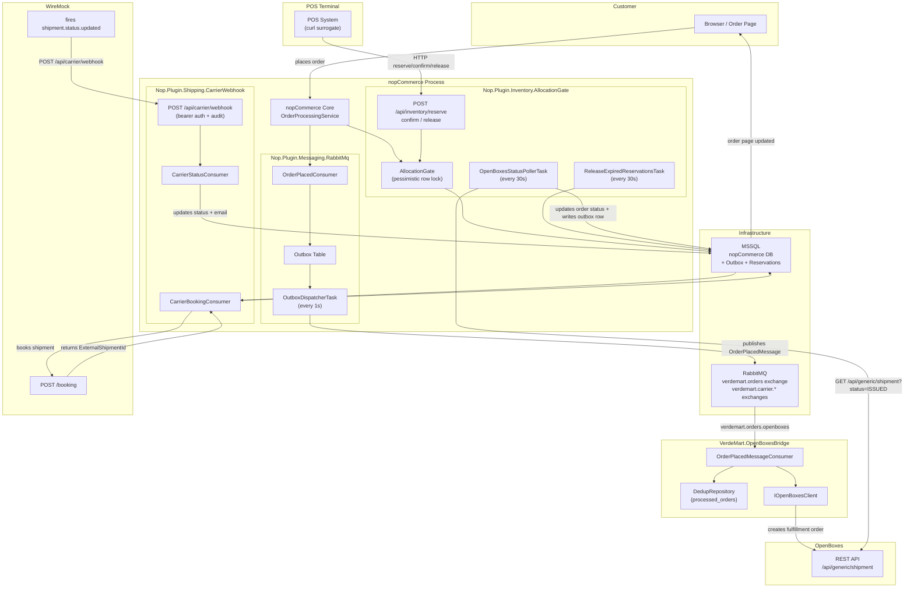
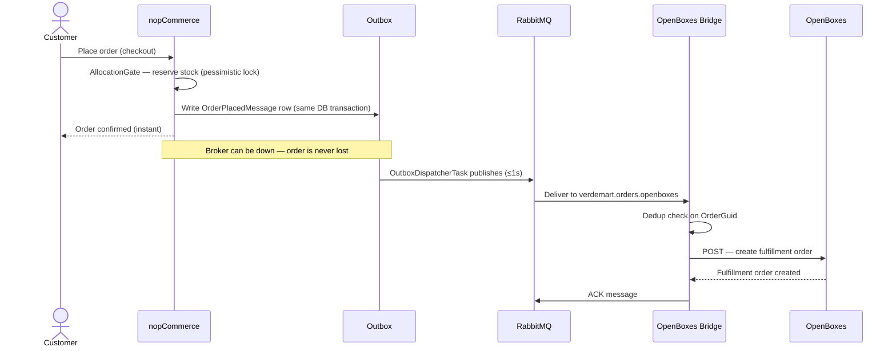
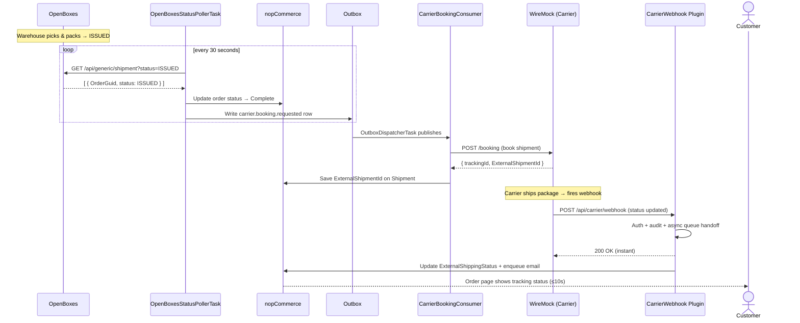
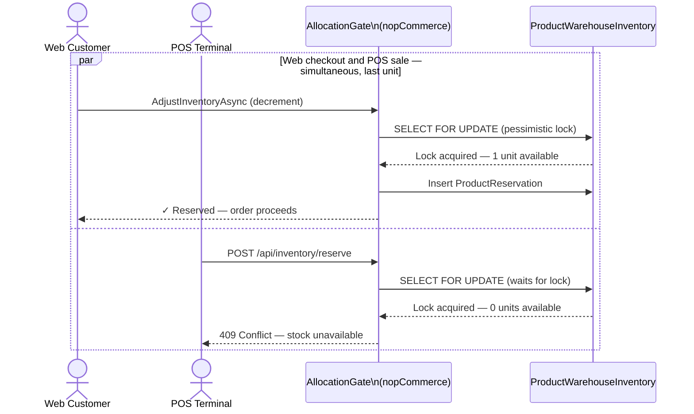

# Target Architecture

**VerdeMart Omnichannel Commerce Core — Iterations 1–5**

---

## System Overview

---

## Use Case 1 — Buy Online / Fulfill Through Another Channel

---

## Use Case 2 — Cross-Channel State Visibility

---

## POS Stock Contention (QAS-2)

---

## Quality Attribute Traceability

| QAS | Mechanism | ADRs |
| --- | --- | --- |
| QAS-1 Reliability — order survives OpenBoxes outage | Transactional outbox + durable queues + idempotent bridge consumer | ADR-003, ADR-004, ADR-005, ADR-009 |
| QAS-2 Consistency — zero oversell web + POS | Pessimistic row lock + shared allocation gate | ADR-006, ADR-007 |
| QAS-3 Availability — checkout <3s under surrounding system slowness | Outbox decouples all surrounding systems from checkout thread | ADR-001, ADR-004 |
| QAS-4 Recoverability — backlog drains after consumer outage | Durable queue + idempotent consumer + automatic redelivery | ADR-003, ADR-009 |
| QAS-5 Visibility — warehouse state ≤30s, carrier tracking ≤10s | OpenBoxes polling task + carrier webhook plugin | ADR-011, ADR-014, ADR-015 |

---

## ADR Index

| ADR | Decision |
| --- | --- |
| ADR-001 | RabbitMQ as message broker |
| ADR-002 | Plugin as integration boundary |
| ADR-003 | Durable queues + manual acknowledgement |
| ADR-004 | Transactional outbox |
| ADR-005 | Outbox dispatcher via IScheduleTask |
| ADR-006 | Allocation gate inside nopCommerce |
| ADR-007 | Cross-channel allocation via synchronous HTTP |
| ADR-008 | OpenBoxes bridge as separate deployable |
| ADR-009 | Idempotent consumer + DLQ |
| ADR-010 | Versioned wire contract with tolerant readers |
| ADR-011 | Webhook ingestion via async queue handoff |
| ADR-012 | External shipment correlation via ExternalShipmentId |
| ADR-013 | External status preserved as string |
| ADR-014 | Outbound carrier booking via existing outbox |
| ADR-015 | OpenBoxes fulfillment state via scheduled polling |
