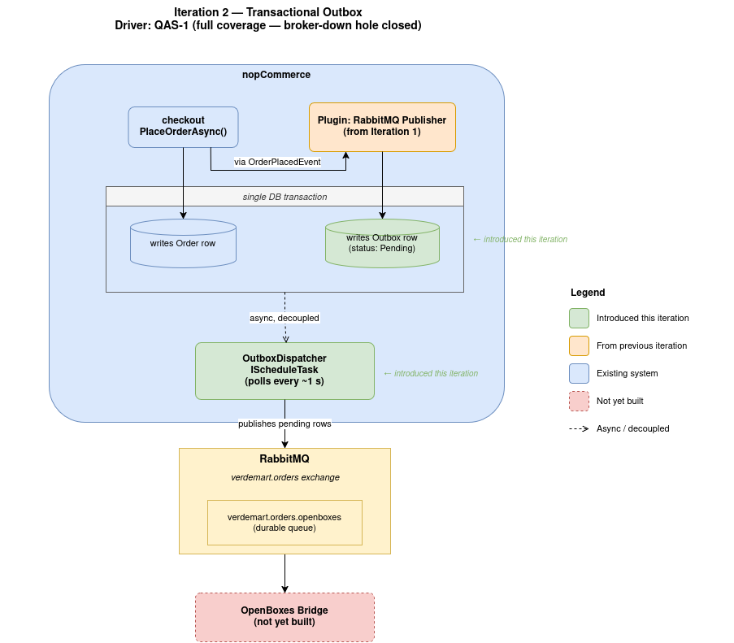

# ADD Iteration 2 — Step 6: Sketch Views and Record Design Decisions

## What This Step Does

Step 6 produces the updated views (component + sequence) for the modified publish path, and records the architectural decisions this iteration produced as ADRs in the consolidated set.

---

## Component View (Updated)

---

## Decisions Recorded

This iteration produced one architectural decision. Its full text lives in `07-adrs/`:

- [ADR-004 — Transactional Outbox for Reliable Publish](../07-adrs/ADR-004-transactional-outbox.md)

---

## What This Iteration Produced

| Artefact | Description |
|---|---|
| Outbox table | New schema in nopCommerce DB with index on `(Status, CreatedAtUtc)` |
| `OutboxWriter` + `IOutboxWriter` | Service that records publish intent inside the order transaction |
| `OutboxRepository` + `IOutboxRepository` | Data access for the dispatcher polling loop |
| `OutboxDispatcherTask` | `IScheduleTask` polling at 1 s, batch size 100 |
| `OutboxSettings` | Configurable poll interval, batch size, max attempts |
| Modified `OrderPlacedConsumer` | Replaces inline publish with outbox write |
| ADR-004 | Transactional Outbox for Reliable Publish |

---

## What Step 7 Will Do

Step 7 verifies the final design against QAS-1's response measure end-to-end and identifies the residual concerns that feed Iteration 3.
