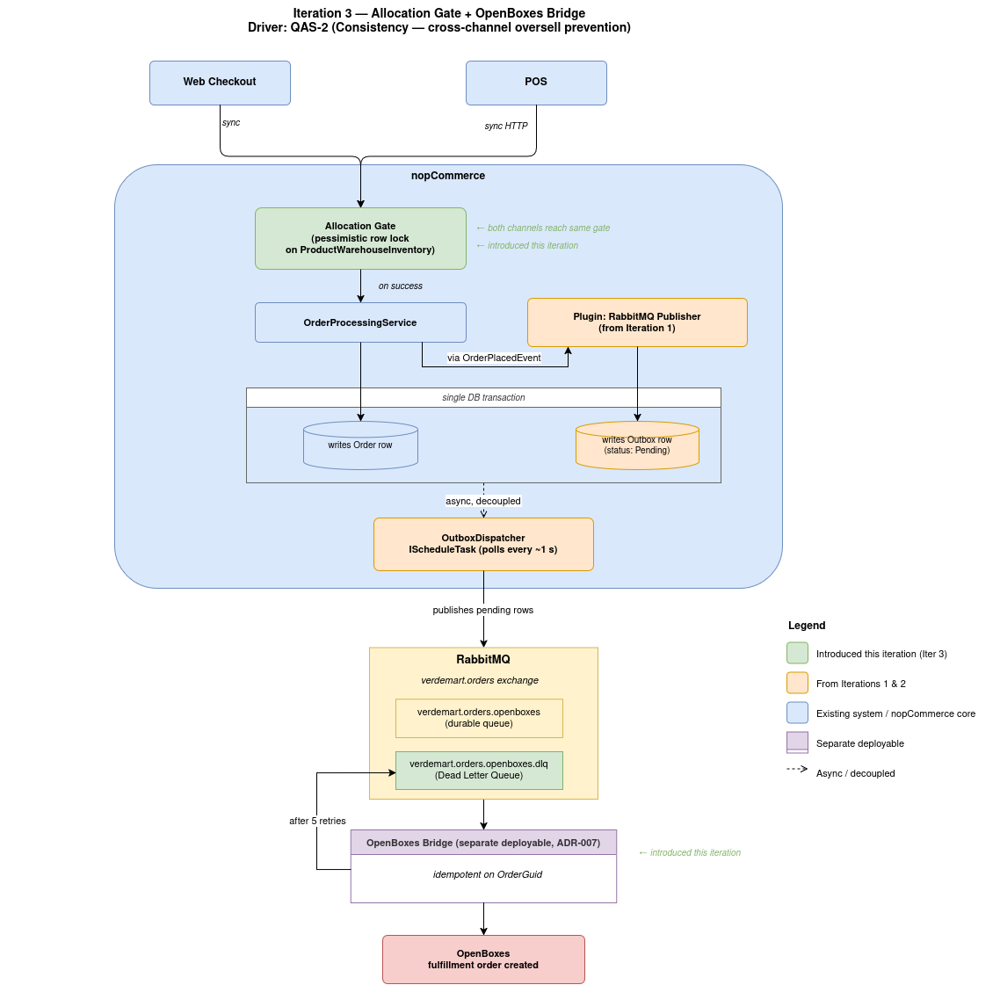

# ADD Iteration 3 — Step 6: Sketch Views and Record Design Decisions

## What This Step Does

Step 6 produces the updated views (component + sequence) for the two new flows — the synchronous allocation gate and the asynchronous bridge consumer — and records the architectural decisions this iteration produced as ADRs in the consolidated `07-adrs/` set.

---

## Component View (Updated)



---

## Sequence — Synchronous Allocation Gate (Web Checkout)

```
Customer browser     Nop.Web Controller     OrderProcessingService     Decorator           AllocationGate     DB
     │ POST /confirm        │                       │                      │                    │             │
     │─────────────────────▶│                       │                      │                    │             │
     │                      │ PlaceOrderAsync       │                      │                    │             │
     │                      │──────────────────────▶│                      │                    │             │
     │                      │                       │ AdjustInventoryAsync │                    │             │
     │                      │                       │─────────────────────▶│                    │             │
     │                      │                       │                      │ ReserveAsync       │             │
     │                      │                       │                      │───────────────────▶│             │
     │                      │                       │                      │                    │ SELECT FOR  │
     │                      │                       │                      │                    │   UPDATE    │
     │                      │                       │                      │                    │────────────▶│
     │                      │                       │                      │                    │ available?  │
     │                      │                       │                      │                    │◀────────────│
     │                      │                       │                      │ AllocationResult   │             │
     │                      │                       │                      │◀───────────────────│             │
     │                      │                       │                      │                    │             │
   [ insufficient ]
     │                      │                       │ ◀-- throw NopException                                  │
     │                      │ ◀-- caught at OrderProcessingService.cs:1634                                    │
     │ "Stock unavailable"  │                                                                                  │
     │◀─────────────────────│                                                                                  │
                                                                                                              
   [ sufficient ]
     │                      │                       │                      │ INSERT ProductReservation        │
     │                      │                       │                      │─────────────────────────────────▶│
     │                      │                       │ inner.AdjustInventoryAsync (actual decrement)            │
     │                      │                       │─────────────────────▶│────────────────────────────────▶│
     │                      │                       │ continue → OrderPlacedEvent fires → Outbox (Iter 2)      │
     │ 200 OK / order page  │                                                                                  │
     │◀─────────────────────│                                                                                  │
```

The losing path is bounded: the gate detects insufficiency, the decorator throws, `OrderProcessingService.PlaceOrderAsync` catches at the existing try/catch, returns `PlaceOrderResult` with the error. QAS-2's "same request cycle" is satisfied.

---

## Sequence — Synchronous Allocation Gate (POS)

```
POS terminal      AllocationApiController      AllocationGate     DB     RabbitMQ
    │ POST /reserve         │                       │             │         │
    │──────────────────────▶│                       │             │         │
    │                       │ ReserveAsync          │             │         │
    │                       │──────────────────────▶│             │         │
    │                       │                       │ SELECT FOR  │         │
    │                       │                       │   UPDATE    │         │
    │                       │                       │────────────▶│         │
    │                       │                       │ INSERT      │         │
    │                       │                       │   Reservation         │
    │                       │                       │────────────▶│         │
    │                       │ 200 / 409             │             │         │
    │◀──────────────────────│                       │             │         │
   [ commit local sale ]
    │ POST /confirm         │                       │             │         │
    │──────────────────────▶│                       │             │         │
    │                       │ ConfirmAsync          │             │         │
    │                       │  + decrement StockQty │             │         │
    │                       │  via inner IProductService          │         │
    │                       │──────────────────────▶│────────────▶│         │
    │                       │ 200 OK                │             │         │
    │◀──────────────────────│                       │             │         │
    │ publish pos.sale.completed (audit)            │             │         │
    │──────────────────────────────────────────────────────────────────────▶│
```

---

## Sequence — Asynchronous Bridge Consumer

```
RabbitMQ            BridgeWorker            OrderPlacedMessageConsumer       OpenBoxesClient        OpenBoxes
   │ deliver message     │                          │                              │                    │
   │────────────────────▶│                          │                              │                    │
   │                     │ open per-message scope    │                              │                    │
   │                     │─────────────────────────▶│                              │                    │
   │                     │                          │ HasProcessedAsync            │                    │
   │                     │                          │ (DedupRepository)            │                    │
                                                                                                        
[ already processed ]                                                                                  
   │◀── Ack ─────────────│                          │                              │                    │
                                                                                                        
[ first time ]                                                                                          
   │                     │                          │ CreateFulfillmentAsync       │                    │
   │                     │                          │─────────────────────────────▶│                    │
   │                     │                          │                              │ POST /fulfillments │
   │                     │                          │                              │───────────────────▶│
   │                     │                          │                              │  201 Created       │
   │                     │                          │                              │◀───────────────────│
   │                     │                          │ RecordProcessedAsync         │                    │
   │                     │                          │ (DedupRepository)            │                    │
   │◀── Ack ─────────────│                          │                              │                    │
                                                                                                        
[ transient failure ]                                                                                   
   │◀── Nack(requeue) ───│                          │ next redelivery → retry                           │
                                                                                                        
[ permanent failure or threshold exceeded ]                                                             
   │◀── Nack(no requeue) │                          │                                                   │
   │ x-dead-letter-exchange routes to DLQ           │                                                   │
   │ → verdemart.orders.openboxes.dlq               │                                                   │
```

---

## Decisions Recorded

This iteration produced three architectural decisions. Their full text lives in `07-adrs/`:

- [ADR-005 — Allocation Gate Hosted Inside nopCommerce](../07-adrs/ADR-005-allocation-gate-inside-nopcommerce.md)
- [ADR-006 — Cross-Channel Allocation via Synchronous HTTP and Async Confirmation](../07-adrs/ADR-006-cross-channel-allocation-sync-http.md)
- [ADR-007 — OpenBoxes Bridge as a Separate Deployable Service](../07-adrs/ADR-007-bridge-as-separate-deployable.md)

---

## What This Iteration Produced

| Artefact | Description |
|---|---|
| nopCommerce plugin | `Nop.Plugin.Inventory.AllocationGate` with 9 named components |
| New entity + table | `ProductReservation` with TTL-bounded reservation rows |
| HTTP endpoints | `POST /api/inventory/reserve`, `confirm`, `release` |
| Schedule task | `ReleaseExpiredReservationsTask` running every 30 s |
| Service decoration | `IProductService` decorated via `IServiceCollection` descriptor swap inside `INopStartup.ConfigureServices` |
| Bridge service | `VerdeMart.OpenBoxesBridge` — independent .NET 8 worker, separate Docker container |
| Bridge dedup | local `processed_orders` table keyed by `OrderGuid` |
| RabbitMQ topology additions | DLX exchange `verdemart.orders.dlx` + queue `verdemart.orders.openboxes.dlq`; existing queue gains `x-dead-letter-exchange` argument |
| Wire contract update | `OrderPlacedMessage.Version = 1` field with tolerant-reader policy |
| ADR-005 | Allocation gate inside nopCommerce |
| ADR-006 | Cross-channel allocation via synchronous HTTP + async confirmation |
| ADR-007 | Bridge as separate deployable |

---

## What Step 7 Will Do

Step 7 verifies the design against QAS-2's response measure and confirms that QAS-1 and QAS-4's end-to-end clauses are now empirically claimable (not only mechanism-only). It names the residual concerns that feed Iteration 4, and closes the iteration.
