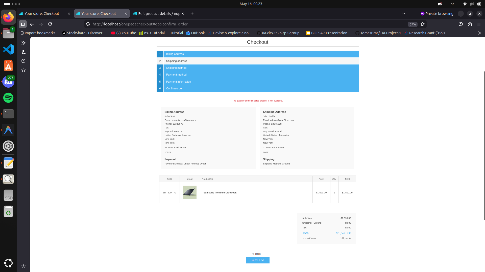

# Resultados dos Testes — AllocationGate

## POS API: reserve + confirm

```bash
curl -s -X POST http://localhost/api/inventory/reserve \
  -H "Content-Type: application/json" \
  -H "X-Api-Key: verdemart-pos-key" \
  -d '{"productId": 6, "warehouseId": 0, "quantity": 1, "reservationKey": "pos-test-1", "ttlSeconds": 300}' \
  | python3 -m json.tool
```
```json
{
    "reservationKey": "pos-test-1",
    "message": "reserved"
}
```

```bash
curl -s -X POST http://localhost/api/inventory/confirm \
  -H "Content-Type: application/json" \
  -H "X-Api-Key: verdemart-pos-key" \
  -d '{"reservationKey": "pos-test-1"}' \
  | python3 -m json.tool
```
```json
{
    "confirmed": true
}
```

---

## POS API: reserve + confirm (TTL curto)

```bash
curl -s -X POST http://localhost/api/inventory/reserve \
  -H "Content-Type: application/json" \
  -H "X-Api-Key: verdemart-pos-key" \
  -d '{"productId": 6, "warehouseId": 0, "quantity": 1, "reservationKey": "pos-test-11", "ttlSeconds": 60}' \
  | python3 -m json.tool
```
```json
{
    "reservationKey": "pos-test-11",
    "message": "reserved"
}
```

```bash
curl -s -X POST http://localhost/api/inventory/confirm \
  -H "Content-Type: application/json" \
  -H "X-Api-Key: verdemart-pos-key" \
  -d '{"reservationKey": "pos-test-11"}' \
  | python3 -m json.tool
```
```json
{
    "confirmed": true
}
```

---

## POS API: reserve + release

```bash
curl -s -X POST http://localhost/api/inventory/reserve \
  -H "Content-Type: application/json" \
  -H "X-Api-Key: verdemart-pos-key" \
  -d '{"productId": 6, "warehouseId": 0, "quantity": 1, "reservationKey": "pos-test-release-001", "ttlSeconds": 300}' \
  | python3 -m json.tool
```
```json
{
    "reservationKey": "pos-test-release-001",
    "message": "reserved"
}
```

```bash
curl -s -X POST http://localhost/api/inventory/release \
  -H "Content-Type: application/json" \
  -H "X-Api-Key: verdemart-pos-key" \
  -d '{"reservationKey": "pos-test-release-001"}' \
  | python3 -m json.tool
```
```json
{
    "released": true
}
```

---

## API Key errada → 401

```bash
curl -s -o /dev/null -w "HTTP Status: %{http_code}\n" \
  -X POST http://localhost/api/inventory/reserve \
  -H "Content-Type: application/json" \
  -H "X-Api-Key: chave-errada" \
  -d '{"productId": 6, "warehouseId": 0, "quantity": 1, "reservationKey": "test-auth"}'
```
```
HTTP Status: 401
```

---

## Route antiga → não 200

```bash
curl -s -o /dev/null -w "HTTP Status: %{http_code}\n" \
  -X POST http://localhost/api/allocation/reserve \
  -H "Content-Type: application/json" \
  -H "X-Api-Key: verdemart-pos-key" \
  -d '{"productId": 6, "warehouseId": 0, "quantity": 1, "reservationKey": "test-route"}'
```
```
HTTP Status: 400
```

---

## Quantidade impossível → 409

```bash
curl -s -o /dev/null -w "HTTP Status: %{http_code}\n" \
  -X POST http://localhost/api/inventory/reserve \
  -H "Content-Type: application/json" \
  -H "X-Api-Key: verdemart-pos-key" \
  -d '{"productId": 6, "warehouseId": 0, "quantity": 9999, "reservationKey": "test-overflow"}'
```
```
HTTP Status: 409
```

---

## Cross-channel: POS bloqueia web (QAS-2)

Stock = 1 no produto. Browser no último passo do checkout (Confirm à vista, não clicado).

POS reserva a última unidade:

```bash
curl -s -X POST http://localhost/api/inventory/reserve \
  -H "Content-Type: application/json" \
  -H "X-Api-Key: verdemart-pos-key" \
  -d '{"productId": 6, "warehouseId": 0, "quantity": 1, "reservationKey": "pos", "ttlSeconds": 300}' \
  | python3 -m json.tool
```
```json
{
    "reservationKey": "pos",
    "message": "reserved"
}
```

Browser clica Confirm → stock = 0 no DB → AllocationGate bloqueia:



> **"The quantity of the selected product is not available."**

Stock nunca ficou negativo. ✅
