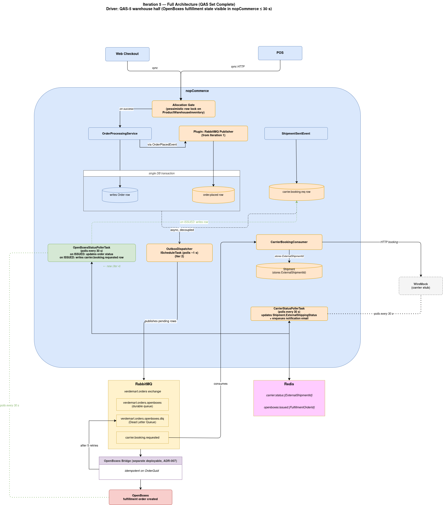

# ADD Iteration 5 — Step 6: Sketch Views and Record Design Decisions

## Updated Component View



## Sequence: Fulfillment State Detected

```text
OpenBoxesStatusPollerTask
    │ (every 30 s)
    │ GET /api/generic/shipment?status=ISSUED
    ▼
OpenBoxes REST API
    │ returns [ { referenceNumber: OrderGuid, status: ISSUED } ]
    ▼
OpenBoxesStatusPollerTask
    │ GetOrderByGuidAsync(OrderGuid)
    │ if Shipment exists + ExternalShipmentId set → skip
    │ else → BEGIN TRANSACTION
    │           InsertShipmentAsync (+ ShipmentItem per order item)
    │             fires ShipmentCreatedEvent
    │           SetOrderStatus(Complete)
    │           write outbox row (carrier.booking.requested, ShipmentId in payload)
    │        COMMIT  (rollback on any failure → next tick retries)
    ▼
OutboxDispatcherTask (existing — Iter 2)
    │ publishes carrier.booking.requested
    ▼
CarrierBookingConsumer (existing — Iter 4)
    │ calls WireMock booking endpoint
    │ writes ExternalShipmentId back to Shipment row
    ▼
Shipment.ExternalShipmentId populated
    │
    ▼ (later)
CarrierStatusConsumer (existing — Iter 4)
    receives webhook → customer sees tracking status
```

---

## Design Decision

Polling was chosen over OpenBoxes webhooks for reliability (self-healing, no missed events) and to preserve the unidirectional dependency between OpenBoxes and nopCommerce. See the rationale in Step 3.

---

## What This Iteration Produced

| Artefact | Description |
| --- | --- |
| `OpenBoxesStatusPollerTask` | New `IScheduleTask` inside `Nop.Plugin.Inventory.AllocationGate` |
| `IOpenBoxesClient` extension | New `GetIssuedFulfillmentOrdersAsync` method |
| `OpenBoxesFulfillmentOrder` DTO | Correlation record from OpenBoxes API |
| `AllocationSettings` extension | Four new fields for OpenBoxes URL, API key, interval, batch size |
| Polling design decision | Deliberate choice over webhooks — reliability and unidirectional dependency |

Step 7 verifies the design against QAS-5's warehouse visibility clause and closes the iteration.
