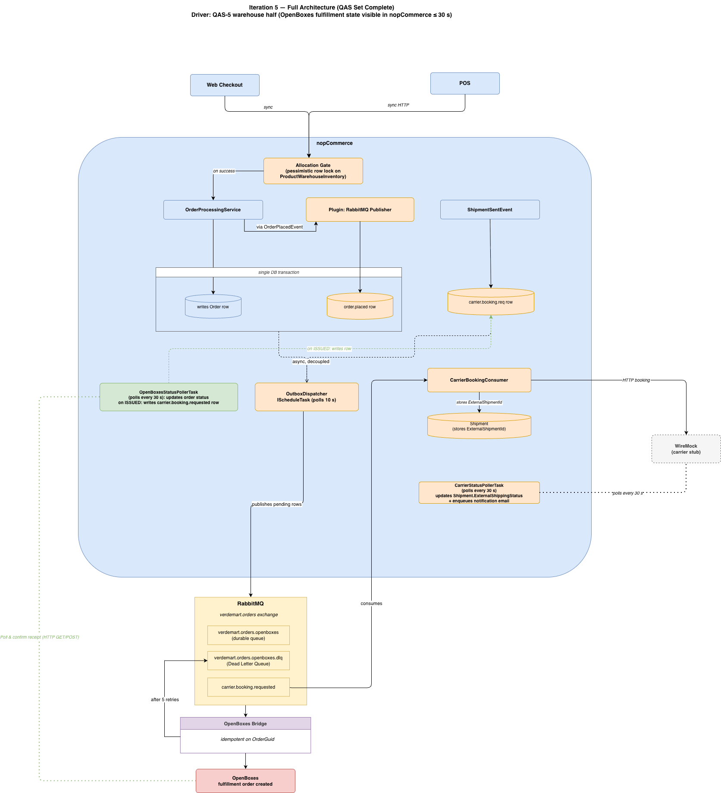

# Architecture Report — VerdeMart Omnichannel Commerce Core

## Scenario

VerdeMart is a retail business whose nopCommerce storefront has grown into the commerce core of a wider enterprise ecosystem. The surrounding systems are OpenBoxes (warehouse), an in-store POS, a shipping carrier (WireMock), and RabbitMQ as the async backbone. The architectural challenge is not connecting more systems — it is deciding how the commerce core should behave when those systems disagree, lag, degrade, or recover.

Three structural tensions drive every design decision:

- **Reliability** — events must not be lost when downstream systems are unavailable.
- **Availability** — checkout must complete regardless of warehouse or carrier latency.
- **Consistency** — stock sold in one channel must be visible and respected in all channels.

Full scenario: [`01-scenario.md`](01-scenario.md) | Current-state analysis: [`02-current-state.md`](02-current-state.md) | Bounded contexts: [`03-bounded-contexts.md`](03-bounded-contexts.md)

---

## Quality Attribute Scenarios

Five QASs translate the business tensions into measurable requirements:

| ID | Attribute | Stimulus | Response Measure |
|----|-----------|----------|-----------------|
| QAS-1 | Reliability | Order placed while OpenBoxes is down | Zero orders lost; delivered within 60 s of recovery |
| QAS-2 | Consistency | Web and POS order same last unit simultaneously | Zero oversell; loser rejected in the same request cycle |
| QAS-3 | Availability | Checkout while surrounding system is slow (> 5 s) | Checkout response under 3 s; no surrounding system on the critical path |
| QAS-4 | Recoverability | OpenBoxes recovers after 30-min outage with 12 orders queued | All 12 processed within 5 min; no operator action |
| QAS-5 | Visibility | Carrier status or OpenBoxes fulfillment state changes | Reflected in nopCommerce within 30 s |

Full scenarios: [`04-qas.md`](04-qas.md)

---

## Design Framework

ADD (Attribute-Driven Design) was applied across five iterations. Each iteration is driven by a specific QAS, produces concrete architectural structures, and leaves the system in a runnable, demonstrable state. This made scope control explicit — every component can be traced to the QAS that justified it.

Framework rationale: [`05-framework-add.md`](05-framework-add.md) | ADD iterations: [`add-iteration-1/`](add-iteration-1/) through [`add-iteration-5/`](add-iteration-5/)

---

## Evolution Path

The architecture was built in five ADD iterations, each closing a specific QAS. Full step-by-step records are in [`add-iteration-1/`](add-iteration-1/) through [`add-iteration-5/`](add-iteration-5/). The evolution roadmap is in [`09-evolution-roadmap.md`](09-evolution-roadmap.md).

| Phase | QAS | Key decision | ADR |
|-------|-----|-------------|-----|
| 1 — Durable Publish | QAS-1 partial | RabbitMQ as async backbone; checkout decoupled from downstream availability | ADR-001 |
| 2 — Transactional Outbox | QAS-1 full, QAS-3 | Outbox table written in same DB transaction as order; dispatcher publishes independently | ADR-004 |
| 3 — Allocation Gate + Bridge | QAS-2 | Pessimistic DB lock as single allocation authority for web and POS; OpenBoxes Bridge as separate Docker service | ADR-005, ADR-006, ADR-007 |
| 4 — Carrier Integration | QAS-5 carrier | Polling over webhooks for carrier status; no inbound HTTP surface | ADR-008 |
| 5 — OpenBoxes Visibility | QAS-5 warehouse | Polling for fulfillment state; direct receive confirmation call-back to OpenBoxes; flag-based idempotency | ADR-009 |

---

## Final Design

### Plugins installed in nopCommerce

| Plugin | Responsibility |
|--------|---------------|
| `Nop.Plugin.Messaging.RabbitMq` | Outbox pattern; publishes `order.placed` to RabbitMQ |
| `Nop.Plugin.Inventory.AllocationGate` | Pessimistic stock lock; `ProductReservation` table |
| `Nop.Plugin.Integration.Pos` | `/api/inventory/reserve|confirm|release` for POS |
| `Nop.Plugin.Shipping.CarrierTracking` | Carrier booking consumer; 30-second status poller |
| `Nop.Plugin.Fulfillment.OpenBoxes` | 30-second OpenBoxes poller; receipt confirmation |

### Key architectural properties

- **Checkout is fully decoupled** from all surrounding systems. The only synchronous dependency at checkout is the DB lock in the allocation gate.
- **At-least-once delivery** is guaranteed for order events via the transactional outbox and durable RabbitMQ queues. All consumers are idempotent.
- **Polling over webhooks** for both external status sources (carrier, OpenBoxes). After any outage, the next tick reads current state unconditionally — no missed events, no operator action.
- **The bridge is independently deployable.** It has no compile-time dependency on nopCommerce. The only shared contract is the RabbitMQ topology and the JSON shape of `OrderPlacedMessage`.
- **Circuit breaker on the OpenBoxes Bridge** (ADR-011) prevents transient outages from polluting the DLQ. The bridge transitions to OPEN state on repeated failures, holds messages in RabbitMQ, and resumes consuming automatically on recovery.

---

## Architectural Decisions

All major decisions, including rejected alternatives, are recorded in [`07-adrs/`](07-adrs/).

| ADR | Decision |
|-----|----------|
| ADR-001 | RabbitMQ as the async message broker |
| ADR-002 | Plugin architecture as the integration boundary |
| ADR-003 | Durable queues, persistent delivery, manual acknowledgement |
| ADR-004 | Transactional outbox for reliable publish |
| ADR-005 | Allocation gate hosted inside nopCommerce |
| ADR-006 | POS reaches the allocation gate via synchronous HTTP |
| ADR-007 | OpenBoxes Bridge as a separate deployable service |
| ADR-008 | Carrier status via scheduled polling (not webhooks) |
| ADR-009 | OpenBoxes fulfillment state via scheduled polling |
| ADR-010 | Redis cache and lock — superseded; design assumptions did not hold |
| ADR-011 | Circuit breaker for OpenBoxes Bridge — transient failure isolation and automatic self-healing |

---

## Known Limitations

- **Multi-node deployment** is not supported for the pollers. Both `CarrierStatusPollerTask` and `OpenBoxesStatusPollerTask` would issue duplicate API calls and concurrent DB writes if multiple nopCommerce nodes ran simultaneously. Writes are idempotent but external API multiplication is not resolved. VerdeMart runs a single node; this is a documented gap for future scale-out.
- **Stock back-propagation from OpenBoxes to nopCommerce** is not implemented. Warehouse-originated stock adjustments (returns, shrinkage, supplier receipts) do not update `Product.StockQuantity`. The demo drives all stock movements through the application, so divergence does not surface during the demonstration.
- **DLQ replay tooling** is not automated. The circuit breaker implemented in ADR-011 routes transient bridge failures back to the RabbitMQ queue rather than to the DLQ — the DLQ now receives only genuine poison messages. Inspection and replay of those still require the RabbitMQ Management Console.

Full risk register and accepted limitations: [`08-risk-and-validation-plan.md`](08-risk-and-validation-plan.md) | Feasibility spike: [`10-feasibility-spike.md`](10-feasibility-spike.md)
