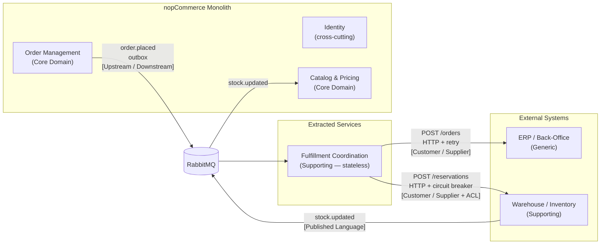

# Bounded Contexts and Domain Model

**Owner: Duarte**  
**Scenario C — Omnichannel Commerce Core (VerdeMart Retail)**

---

## Identified Bounded Contexts

Subdomain classification:
- **Core Domain** — primary business differentiator; highest investment priority
- **Supporting Subdomain** — operationally necessary but not a competitive differentiator
- **Generic Subdomain** — standard capability; could be bought off the shelf

### 1. Order Management (nopCommerce — Core Domain)
- **Owns**: Orders, order items, order status, payment status, integration event outbox
- **Key entities**: `Order`, `OrderItem`, `OrderNote`, `IntegrationEvent` (outbox)
- **Relationships**: upstream of Fulfillment Coordination (publishes `order.placed`); downstream of Warehouse/Inventory (consumes `stock.updated`)
- **Data store**: nopCommerce PostgreSQL — authoritative, not shared

### 2. Catalog & Pricing (nopCommerce — Core Domain)
- **Owns**: Products, categories, prices, discounts, attributes, stock quantities
- **Key entities**: `Product`, `Category`, `ProductWarehouseInventory`, `StockQuantityHistory`
- **Note**: nopCommerce is the source of truth for web-visible stock; the WMS is the source of truth for physical stock. The two are reconciled via `stock.updated` events.
- **Data store**: nopCommerce PostgreSQL — authoritative, not shared

### 3. Fulfillment Coordination (Order Integration Service — Supporting Subdomain)
- **Owns**: The coordination protocol between the commerce core and external operational systems
- **Stateless by design** — does not persist orders; reads from RabbitMQ, forwards to ERP and WMS adapters
- **Key responsibility**: reliability — retry on ERP, circuit breaker + dead-letter queue + reconciliation on WMS
- **Data store**: None — RabbitMQ dead-letter queue provides transient durability during WMS outage

### 4. ERP / Back-Office (ERP Stub — Generic Subdomain)
- **Owns**: Confirmed order records for accounting and invoicing
- **Receives**: `order.placed` events forwarded by Fulfillment Coordination via HTTP
- **Data store**: In-memory — isolated; never shared with nopCommerce or WMS

### 5. Warehouse / Inventory (WMS Stub — Supporting Subdomain)
- **Owns**: Physical stock quantities and warehouse reservation state
- **Publishes**: `stock.updated` to RabbitMQ after a successful reservation
- **Pressure point**: the WMS can become slow, unavailable, or contradictory — the architecture must isolate this failure from the rest of the system
- **Data store**: In-memory — isolated; never shared with nopCommerce or ERP

---

## Context Map

### Relationship Descriptions

**Order Management → Fulfillment Coordination: Upstream / Downstream**  
nopCommerce defines the `order.placed` schema and publishes it without knowledge of consumers. The outbox pattern ensures the event is written atomically with the order — nopCommerce never waits for the Integration Service to be available.

**Fulfillment Coordination → ERP: Customer / Supplier**  
The Integration Service calls the ERP over HTTP with exponential-backoff retry (Polly). The ERP owns its own data model; the Integration Service translates to it. ERP failure does not block order placement.

**Fulfillment Coordination → WMS: Customer / Supplier with Anti-Corruption Layer**  
The circuit breaker (Polly) on the WMS adapter acts as the ACL: it absorbs WMS instability, opens after repeated failures, and routes undeliverable messages to the dead-letter queue rather than blocking order flow.

**WMS → Catalog & Pricing: Published Language**  
The WMS publishes `stock.updated` events using a stable, well-defined schema. nopCommerce consumes these events to correct web-visible stock quantities without knowing WMS internals, enabling cross-channel stock visibility.

---

## Data Ownership Rules

| Data | Authoritative Owner | How other contexts access it |
|------|---------------------|------------------------------|
| Order state | nopCommerce (Order Management) | Read-only; never written by external systems directly |
| Product stock quantity | nopCommerce (Catalog) | Updated by `StockUpdateConsumerBackgroundService` on `stock.updated` |
| Warehouse reservation | WMS Stub | Never read by nopCommerce directly |
| ERP order record | ERP Stub | Never read by nopCommerce directly |

No shared database across extracted boundaries. Cross-context communication is exclusively via events or explicit HTTP calls with well-defined contracts.

---

## Scope Decisions

Scenario C lists eight candidate surrounding systems. The table below records which were included and why the rest were excluded.

| System | Decision | Justification |
|--------|----------|---------------|
| ERPNext / Odoo (ERP) | **In scope — ERP Stub** | Required by UC1: every placed order must reach the back-office. Introduces the retry reliability pattern on the FC → ERP edge. |
| OpenBoxes / WMS | **In scope — WMS Stub** | Required by UC1, UC2, and the mandatory pressure point. Introduces circuit breaker, dead-letter queue, and reconciliation loop. |
| Open Source POS | **Out of scope** | Would duplicate the WMS pressure point without adding a new architectural pattern. UC2 is already covered by the WMS → nopCommerce `stock.updated` flow, which represents any channel that modifies physical stock. |
| EspoCRM | **Out of scope** | CRM concerns (loyalty, support history) do not affect order placement or fulfillment and are not exercised by either mandatory use case. |
| OpenSearch / Meilisearch | **Out of scope** | Search freshness is orthogonal to the reliability and cross-channel visibility problem. Search index staleness does not affect the order or fulfillment path. |
| WireMock / Shipping carrier | **Out of scope** | Shipping occurs after fulfillment is confirmed and does not affect order acceptance or WMS reservation. Neither mandatory use case requires it. |
| Keycloak / authentik | **Out of scope** | nopCommerce has built-in auth. Federated identity is the core problem of Scenario A, not Scenario C. |
| RabbitMQ / Kafka | **In scope — RabbitMQ** | Required for the async workflow and dead-letter pattern. See ADR-001 for the choice over Kafka. |

ERP and WMS are the only systems directly exercised by both mandatory use cases and the mandatory pressure point. All others add operational complexity without changing the architectural patterns demonstrated.
