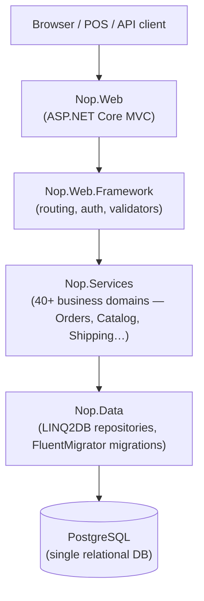
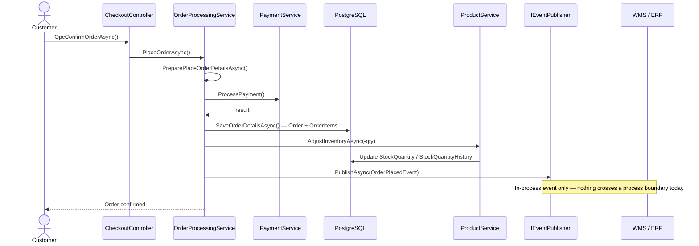
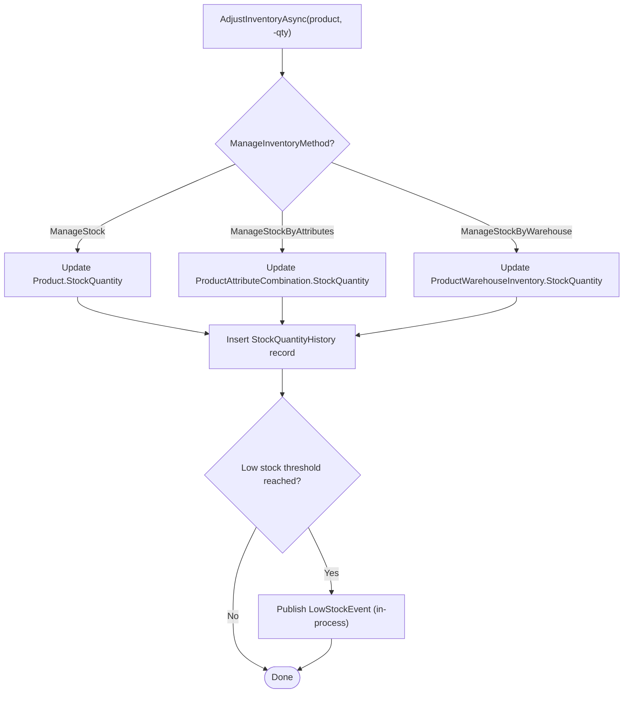

# Current-State Analysis of nopCommerce

**Scenario C — Omnichannel Commerce Core (VerdeMart Retail)**

## 1. System Overview

nopCommerce 5.00 is a **modular monolith** built on ASP.NET Core 10.0 with a layered / onion-style structure. All components run in a single deployable unit (Nop.Web). Data access uses LINQ2DB with a single relational database (MSSQL / PostgreSQL / MySQL).

There are no external system integrations in the baseline. nopCommerce manages its own inventory, orders, shipping, and customer records — entirely self-contained.

## 2. Order Flow (Relevant to Scenario C)

The critical path for Scenario C is the **order placement flow**:

**Key observation**: `OrderPlacedEvent` is published via nopCommerce's in-process `IEventPublisher`. Any `IConsumer<OrderPlacedEvent>` running in the same process can react, but **nothing crosses a process boundary** today. There is no outbox, no message broker, and no external system notification.

### Inventory adjustment (same transaction scope)
After order placement, `ProductService.AdjustInventoryAsync()` is called synchronously within `MoveShoppingCartItemsToOrderItemsAsync()`. Stock is reduced in the nopCommerce DB only — no warehouse system is notified.

### Order statuses tracked in nopCommerce
`Order` entity (`src/Libraries/Nop.Core/Domain/Orders/Order.cs`) tracks three independent status dimensions:
- `OrderStatus`: Pending → Processing → Complete → Cancelled
- `PaymentStatus`: Pending → Authorized → Paid → Refunded …
- `ShippingStatus`: NotYetShipped → PartiallyShipped → Shipped → Delivered

These statuses are nopCommerce-owned and not visible to any external warehouse or ERP system in the baseline.

## 3. Architectural Seams (Injection Points for Scenario C)

| Seam | Location | What we can inject |
|------|----------|--------------------|
| Post-order-placed | `OrderProcessingService.PlaceOrderAsync()` line ~1617 | Write outbox event row after `OrderPlacedEvent` |
| Stock update (inbound) | `ProductService.AdjustInventoryAsync()` | Accept stock corrections from WMS via new consumer |
| Order status update | `OrderProcessingService` | Accept fulfillment confirmations from ERP/WMS |
| Catalog/stock read | `ProductService.GetTotalStockQuantityAsync()` | Serves web storefront — affected by stock staleness |

## 4. Pressure Points (How Scenario C Stresses the Current Architecture)

| Pressure | Current behavior | Desired behavior after evolution |
|----------|-----------------|----------------------------------|
| Warehouse unavailable | Order placed, stock reduced in nopCommerce DB only — WMS never notified | Orders queued; WMS notified when it recovers |
| Stock sold in physical store | nopCommerce has no awareness; web stock shows stale quantity | WMS pushes stock update; nopCommerce reflects it |
| ERP unreachable | Order confirmed to customer; ERP has no record | Retry until ERP acknowledges; order not lost |
| Cross-channel order state | Customer cannot see fulfillment progress from WMS | nopCommerce order status updated by WMS events |

## 5. What the Monolith Does Well (Keep Inside)

- Customer management, authentication, cart, checkout flow
- Payment processing (plugin system)
- Product catalog, pricing, promotions, discounts
- Order lifecycle state machine (status transitions)
- Admin UI for store management

These **remain inside nopCommerce**. The evolution does not extract them.

## 6. What Must Change

1. **Outbox mechanism**: nopCommerce needs to write integration events to a local table as part of the order transaction, then a background process publishes them to RabbitMQ. This decouples the order placement from broker availability.
2. **Stock update consumer**: A new background service inside nopCommerce listens for `stock.updated` events from RabbitMQ and calls `ProductService.AdjustInventoryAsync()`.
3. **Health/observability endpoint**: nopCommerce exposes pending outbox count and last-published timestamp so the operator dashboard can show the integration state.

## 7. nopCommerce Extension Points Used

| Extension point | How we use it |
|----------------|---------------|
| `IConsumer<T>` + `IEventPublisher` | Existing event system — we implement `IConsumer<OrderPlacedEvent>` to trigger outbox write |
| `IStartupTask` / `INopStartup` | Register RabbitMQ background services in DI |
| FluentMigrator migrations (`src/Libraries/Nop.Data/Migrations/`) | Add `IntegrationEvent` outbox table |
| `IRepository<T>` | LINQ2DB-backed repository for the outbox table |
| `IProductService.AdjustInventoryAsync()` | Update stock from WMS events |

## 8. Files Most Relevant to the Evolution

| File | Relevance |
|------|-----------|
| `src/Libraries/Nop.Services/Orders/OrderProcessingService.cs` | Entry point for order placement — outbox write hook |
| `src/Libraries/Nop.Services/Catalog/ProductService.cs` | Stock management — `AdjustInventoryAsync` |
| `src/Libraries/Nop.Core/Domain/Orders/Order.cs` | Order entity, status enum |
| `src/Libraries/Nop.Core/Events/IEventPublisher.cs` | In-process event bus |
| `src/Libraries/Nop.Data/Migrations/` | FluentMigrator — location for outbox table migration |
| `src/Libraries/Nop.Core/Infrastructure/INopStartup.cs` | Where background services are registered |
| `src/Presentation/Nop.Web/Controllers/CommonController.cs` | Health endpoint location |
