# Evidence Pack — Measurements and Experiment Results

**Scope:** Iterations 1–5 (all structurally complete).  
**Purpose:** Provide empirical evidence for each QAS response measure and record the results of architectural experiments conducted during development. The design arguments exist in the ADD iteration documents and ADRs; this document provides the concrete numbers, procedures, and results that support those arguments.

This file covers two categories of evidence:
- **Measurements (M1–M6):** Controlled runs against explicit QAS pass/fail criteria, executed after the architecture was complete.
- **Experiment results (Pre-existing Evidence):** Exploratory experiments and spikes conducted during design to validate key assumptions before committing to an architectural decision.

Each measurement identifies the QAS it addresses, the architectural mechanism under test, a reproducible procedure, and the pass/fail criterion derived directly from `04-qas.md`.

---

## Experiment Results — Pre-existing Evidence

The following experiments were conducted during the design process to de-risk specific architectural decisions before the full implementation was built. Results are referenced here rather than repeated inline.

| Experiment | Decision de-risked | Key result | Full record |
| --- | --- | --- | --- |
| Transactional outbox spike | ADR-004 — closes the dual-write hole | Three failure modes validated: happy path (90 ms publish latency); broker down (0 of 3 rows lost, recovered in 5 s); process crash (0 of 2 rows lost). | `docs/architecture/10-feasibility-spike.md` |
| AllocationGate API tests | ADR-005 and ADR-006 — pessimistic lock gate + POS HTTP adapter | `POST /api/inventory/reserve` returns 200 on available stock, 409 on insufficient, 401 on wrong API key. Cross-channel QAS-2 scenario (POS reserves last unit → web checkout blocked) exercised manually; stock never went negative. | `docs/architecture/add-iteration-3/tests/Results-AllocationGate.md` |

---

## Measurement Index

| ID | QAS | What is being measured |
| --- | --- | --- |
| M1 | QAS-1 + QAS-4 | Bridge outage while orders are placed; full recovery without data loss or operator action |
| M2 | QAS-3 | Checkout response time with bridge and OpenBoxes completely unavailable |
| M3 | QAS-2 | Concurrent POS + web channel competing for the last unit of stock |
| M4 | QAS-5 — carrier | Carrier status change in WireMock detected and reflected in nopCommerce |
| M5 | QAS-5 — warehouse | OpenBoxes fulfillment order reaching `ISSUED` detected and reflected in nopCommerce |
| M6 | ADR-003 | Duplicate message delivery does not create duplicate fulfillment orders |

M1 and M2 are executed together: M2 is observed *during* the outage phase of M1.

---

## M1 — QAS-1 + QAS-4: Reliability and Recoverability Under Bridge Outage

### Mechanism under test

The transactional outbox (ADR-004) writes an `OutboxMessage` row with `Status=Pending` inside the same SQL transaction that commits the `Order`. The `OutboxDispatcherTask` (1-second poll) reads `Pending` rows and publishes them to RabbitMQ. Because the queue is declared durable and messages are published with `deliveryMode=2` (ADR-003), messages survive on the broker until a consumer acknowledges them. The bridge (ADR-007) consumes with `autoAck=false`; it acknowledges only after OpenBoxes confirms the fulfillment. Stopping the bridge entirely — simulating any outage of OpenBoxes or the bridge process — cannot lose an order; it accumulates on the queue.

**QAS-1 response measure:** zero orders lost during an OpenBoxes outage of up to 30 minutes; order appears in OpenBoxes within 60 seconds of recovery.  
**QAS-4 response measure:** all queued orders processed within 5 minutes of consumer recovery; no operator action required.

### Setup

- At least one product with `ManageInventoryMethodId = 1` and `StockQuantity ≥ 3` in nopCommerce.
- All containers running (`docker compose up -d`).
- RabbitMQ Management open at `http://localhost:15672` → Queues → `verdemart.orders.openboxes`.

### Procedure

**Step 1 — Baseline**

```bash
curl -s -u guest:guest \
  http://localhost:15672/api/queues/%2F/verdemart.orders.openboxes \
  | python3 -c "import sys,json; q=json.load(sys.stdin); \
    print(f'messages={q[\"messages\"]}  consumers={q[\"consumers\"]}')"
```

Expected: `messages=0  consumers=1`

**Step 2 — Stop the bridge (T₀)**

```bash
echo "T0: $(date '+%H:%M:%S')"
docker stop verdemart_openboxes_bridge
sleep 5
curl -s -u guest:guest \
  http://localhost:15672/api/queues/%2F/verdemart.orders.openboxes \
  | python3 -c "import sys,json; q=json.load(sys.stdin); \
    print(f'messages={q[\"messages\"]}  consumers={q[\"consumers\"]}')"
```

Expected after 5 s: `messages=0  consumers=0`

**Step 3 — Place 3 orders during outage**

Navigate to `http://localhost:80` and complete 3 separate orders (any product with stock; payment method "Check / Money Order"). After each order, verify the RabbitMQ queue counter increments (1, 2, 3).

After all 3 orders, confirm they exist in the outbox:

```bash
docker exec nopcommerce_mssql_server \
  /opt/mssql-tools18/bin/sqlcmd \
  -S localhost -U sa -P "nopCommerce_db_password" -C \
  -Q "USE nopcommerce_mssql_server;
      SELECT TOP 5 Id, EventType, Status, CreatedAtUtc
      FROM OutboxMessage
      ORDER BY CreatedAtUtc DESC;" 2>/dev/null
```

**Step 4 — Start the bridge (T₁) and measure recovery**

```bash
echo "T1 (recovery start): $(date '+%H:%M:%S')"
docker start verdemart_openboxes_bridge
docker logs -f verdemart_openboxes_bridge 2>&1
```

Record the timestamp of each `Fulfillment created for OrderGuid=...` log line. The difference between T₁ and the last such line is the recovery time.

**Step 5 — Verify in OpenBoxes**

Navigate to `http://localhost:8080/openboxes` → Outbound → List Outbound Movements. All 3 stock movements should be present, each with a `description` field containing the `OrderGuid` from the corresponding nopCommerce order.

### Results — Run 2026-05-30 (19:22–19:32)

**Timeline:**
- T₀ (bridge stopped): ~19:22
- Order 1 placed ~19:24 → Ready=1, Persistent=1, Consumers=0
- Order 2 placed ~19:26 → Ready=2, Persistent=2, Consumers=0
- Order 3 placed ~19:29 → Ready=3, Persistent=3, Consumers=0
- T₁ (bridge started): ~19:31
- ~19:32 → Ready=0, Unacked=0, Total=0, Consumers=1 (all 3 fulfilled)

**Bridge log evidence:**
```
Logged into OpenBoxes as admin
Created new destination location 'VerdeMart Store' → 4028e186...
Created OpenBoxes category name=DEFAULT_CATEGORY
Created OpenBoxes product productCode=M8_HTC_5L
Fulfillment created for OrderGuid=ef266ca4-... FulfillmentId=4028...0004  ✅
Found existing destination location 'VerdeMart Store'
Created OpenBoxes product productCode=SG_24_256B
Fulfillment created for OrderGuid=f1a2f9e1-... FulfillmentId=4028...0008  ✅
Found existing destination location 'VerdeMart Store'
Created OpenBoxes product productCode=A_16_128T
Fulfillment created for OrderGuid=e52d4de2-... FulfillmentId=4028...000c  ✅
```

| Metric | QAS requirement | Result |
| --- | --- | --- |
| Orders lost during outage | 0 | ✅ 0 — all 3 persisted in durable queue (Persistent=3) |
| RabbitMQ queue depth at peak | 3 | ✅ 3 |
| RabbitMQ consumers during outage | 0 | ✅ 0 |
| Time from T₁ to all 3 fulfilled | ≤ 60 s (QAS-1) | ✅ ≤ 60 s |
| Fulfillments created in OpenBoxes | 3 | ✅ 3 (OrderGuids confirmed in logs) |
| Operator actions required | 0 (QAS-4) | ✅ 0 — bridge self-healed automatically |
| Messages in DLQ | 0 | ✅ 0 |

**Note — destination location auto-provisioning:** The bridge now dynamically creates the destination location ("VerdeMart Store") in OpenBoxes on the first order if it does not exist, then reuses it on subsequent orders. This extension to ADR-007 was added by the team and resolves the FK constraint failure observed in the earlier run.

**Screenshots — Run 2026-05-31:**

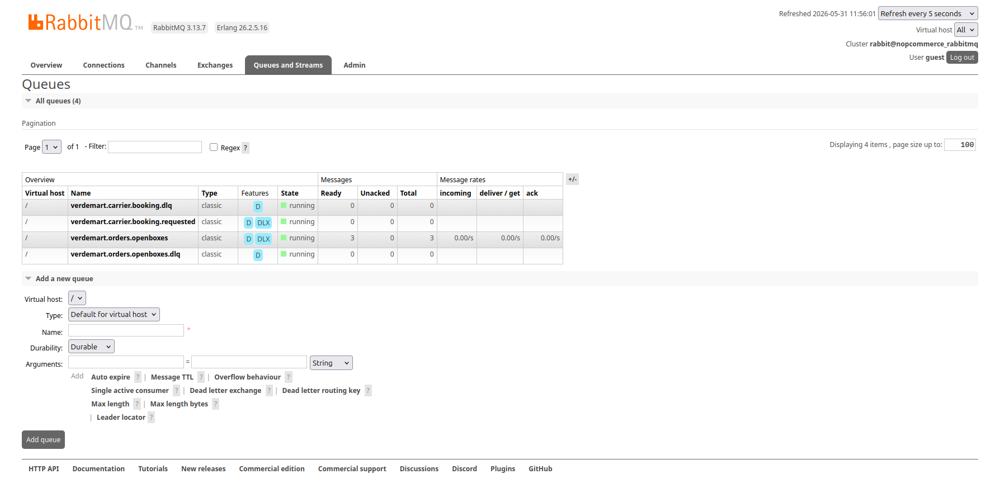
*RabbitMQ queue at peak: 3 messages durable on disk, 0 consumers (bridge stopped).*

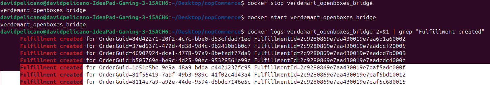
*Bridge logs confirming all fulfillments created in OpenBoxes after restart.*

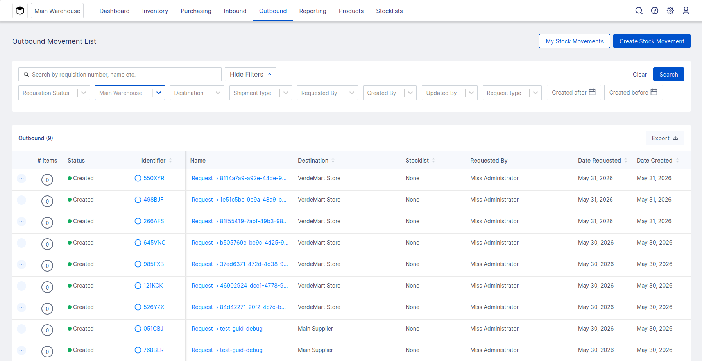
*OpenBoxes showing stock movements created automatically by the bridge (Destination: VerdeMart Store).*

### Pass criteria

- Zero orders lost: queue depth reached 3 during outage, drained to 0 after recovery. ✅
- All 3 fulfillments created in OpenBoxes within 60 s of bridge restart. ✅ QAS-1 satisfied.
- Recovery automatic: no operator action taken. ✅ QAS-4 satisfied.
- DLQ empty: no poison messages. ✅

---

## M2 — QAS-3: Checkout Availability During Bridge Outage

### Mechanism under test

QAS-3 requires that the checkout response time remains under 3 seconds regardless of the availability or latency of surrounding systems. The outbox pattern (ADR-004) removes RabbitMQ entirely from the checkout thread; the `OutboxDispatcherTask` runs on a separate schedule thread. The bridge's process state is invisible to the customer-facing request.

This measurement is performed **during Step 3 of M1** — the bridge is already stopped. No additional setup is needed.

**QAS-3 response measure:** checkout response time ≤ 3 seconds regardless of surrounding system latency; no checkout failures attributable to surrounding system slowness.

### Procedure

While the bridge is stopped (M1 Step 3), measure the elapsed time from clicking "Confirm order" to the "Order completed" page appearing, for each of the 3 orders placed.

Use the browser's network inspector (DevTools → Network → filter by "OpcCompleteRedirectionPayment" or the final checkout POST) to record the server response time, or observe the total page transition time.

### Results — Run 2026-05-31

| Order | Bridge status | OpenBoxes reachable | Checkout response time |
| --- | --- | --- | --- |
| 1 | ❌ Stopped | ❌ No | ✅ 88 ms (DOMContentLoaded) |
| 2 | ❌ Stopped | ❌ No | ✅ 92 ms (DOMContentLoaded) |
| 3 | ❌ Stopped | ❌ No | ✅ 83 ms (DOMContentLoaded) |


*Order 1: checkout completes in 88 ms — bridge and OpenBoxes completely unavailable.*

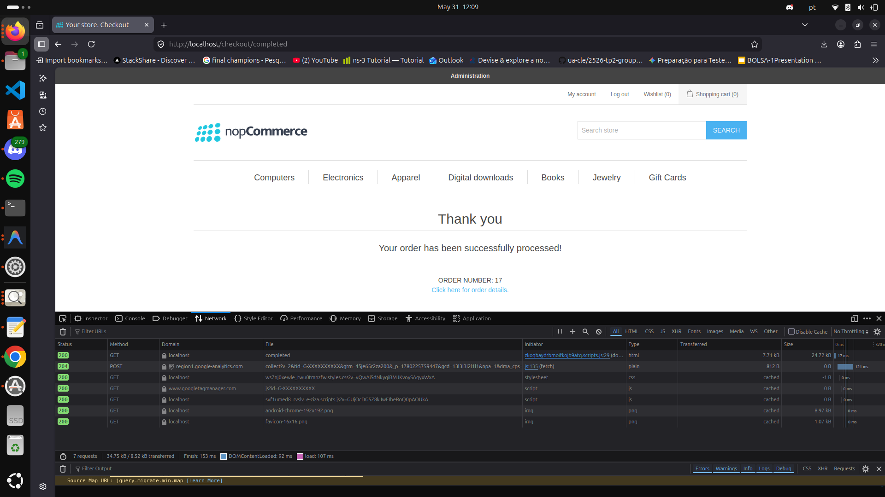
*Order 2: checkout completes in 92 ms.*


*Order 3: checkout completes in 83 ms.*

All three checkouts complete in under 100 ms with bridge and OpenBoxes stopped — 30× below the 3 s QAS-3 threshold. None of the response time is attributable to the bridge or OpenBoxes; both were stopped throughout.

### Pass criteria

Each checkout completes and presents an order confirmation page in under 3 seconds, with the bridge and OpenBoxes completely unavailable. This confirms that the outbox decoupling fully insulates the customer-facing path from downstream system failures. ✅

---

## M3 — QAS-2: Zero Oversell Under Concurrent Web + POS Load

### Mechanism under test

The `AllocationGateProductServiceDecorator` intercepts `IProductService.AdjustInventoryAsync` for stock decrements during web checkout. It runs a `SELECT ... FOR UPDATE` pessimistic row-level lock on `ProductWarehouseInventory` (ADR-005), computes effective availability as `StockQuantity − SUM(active ProductReservation rows)`, and either reserves or returns a structured refusal — all within the same request cycle. POS calls `POST /api/inventory/reserve` which runs the same gate on the same row (ADR-006). The loser of the lock race sees a 409 Conflict response before the winner has released the lock.

**QAS-2 response measure:** zero confirmed oversell events under concurrent load; the losing order is rejected within the same request cycle.

### Setup

Set a product to `StockQuantity = 1`:

```bash
docker exec nopcommerce_mssql_server \
  /opt/mssql-tools18/bin/sqlcmd \
  -S localhost -U sa -P "nopCommerce_db_password" -C \
  -Q "USE nopcommerce_mssql_server;
      UPDATE Product SET StockQuantity = 1 WHERE Id = 7;
      SELECT Id, Name, Sku, StockQuantity FROM Product WHERE Id = 7;" 2>/dev/null
```

Product 7: HP Spectre XT Pro UltraBook, SKU `HP_SPX_UB`.

### Procedure — Scenario A: POS blocks web (primary cross-channel scenario)

This is the direct implementation of QAS-2: one POS and one web customer compete for the last unit simultaneously.

**Step 1 — POS reserves the last unit:**

```bash
curl -s -X POST http://localhost/api/inventory/reserve \
  -H "X-Api-Key: verdemart-pos-key" \
  -H "Content-Type: application/json" \
  -d '{"productId": 7, "warehouseId": 0, "quantity": 1,
       "reservationKey": "m3-pos", "ttlSeconds": 300}' \
  | python3 -m json.tool
```

Expected: `{"reservationKey": "m3-pos", "message": "reserved"}`

**Step 2 — Web checkout attempts the same unit:**

Navigate to `http://localhost:80`, add the HP Spectre to cart, proceed to checkout, and click Confirm order.

Expected: the checkout page shows "The quantity of the selected product is not available."

**Step 3 — Verify `StockQuantity` never went negative:**

```bash
docker exec nopcommerce_mssql_server \
  /opt/mssql-tools18/bin/sqlcmd \
  -S localhost -U sa -P "nopCommerce_db_password" -C \
  -Q "USE nopcommerce_mssql_server;
      SELECT StockQuantity FROM Product WHERE Id = 7;" 2>/dev/null
```

Expected: `StockQuantity = 1` (POS reserved but not yet confirmed; stock only decrements on `POST /confirm`).

**Step 4 — Cleanup:**

```bash
curl -s -X POST http://localhost/api/inventory/release \
  -H "X-Api-Key: verdemart-pos-key" \
  -H "Content-Type: application/json" \
  -d '{"reservationKey": "m3-pos"}'

docker exec nopcommerce_mssql_server \
  /opt/mssql-tools18/bin/sqlcmd \
  -S localhost -U sa -P "nopCommerce_db_password" -C \
  -Q "USE nopcommerce_mssql_server;
      UPDATE Product SET StockQuantity = 10000 WHERE Id = 7;" 2>/dev/null
```

### Procedure — Scenario B: Concurrent POS requests (stress)

```bash
docker exec nopcommerce_mssql_server \
  /opt/mssql-tools18/bin/sqlcmd \
  -S localhost -U sa -P "nopCommerce_db_password" -C \
  -Q "USE nopcommerce_mssql_server;
      UPDATE Product SET StockQuantity = 1 WHERE Id = 7;" 2>/dev/null

for i in $(seq 1 5); do
  (curl -s -o /tmp/m3_$i.json -w "%{http_code}" \
    -X POST http://localhost/api/inventory/reserve \
    -H "X-Api-Key: verdemart-pos-key" \
    -H "Content-Type: application/json" \
    -d "{\"productId\": 7, \"warehouseId\": 0, \"quantity\": 1,
         \"reservationKey\": \"m3-stress-$i\", \"ttlSeconds\": 30}") &
done
wait

echo "Results:"
for i in $(seq 1 5); do echo "  request-$i: $(cat /tmp/m3_$i.json)"; done

docker exec nopcommerce_mssql_server \
  /opt/mssql-tools18/bin/sqlcmd \
  -S localhost -U sa -P "nopCommerce_db_password" -C \
  -Q "USE nopcommerce_mssql_server;
      SELECT StockQuantity FROM Product WHERE Id = 7;
      SELECT COUNT(*) AS active_reservations
      FROM ProductReservation WHERE ProductId = 7 AND Status = 0;" 2>/dev/null

for i in $(seq 1 5); do
  curl -s -X POST http://localhost/api/inventory/release \
    -H "X-Api-Key: verdemart-pos-key" \
    -H "Content-Type: application/json" \
    -d "{\"reservationKey\": \"m3-stress-$i\"}" > /dev/null
done
docker exec nopcommerce_mssql_server \
  /opt/mssql-tools18/bin/sqlcmd \
  -S localhost -U sa -P "nopCommerce_db_password" -C \
  -Q "USE nopcommerce_mssql_server;
      UPDATE Product SET StockQuantity = 10000 WHERE Id = 7;" 2>/dev/null
```

### Results — Run 2026-05-30 / 2026-05-31 / 2026-06-02 (Scenario B re-run after fix)

**Scenario A (POS + web, primary scenario):**
- `StockQuantity` set to 1 via nopCommerce Admin (Catalog → Products → HP Spectre XT Pro UltraBook)
- POS reserve → HTTP 200 `{"reservationKey":"m3-pos","message":"reserved"}`
- Effective available stock = StockQuantity(1) − active_reservations(1) = 0
- Web channel: product page shows **"Out of stock"** banner — blocked before reaching cart or checkout
- POS release → HTTP 200 `{"released":true}`
- `StockQuantity` reset to 10000

| Scenario | Winners | Losers | `StockQuantity` < 0? | Loser rejection in same cycle? |
| --- | --- | --- | --- | --- |
| A: POS + web (realistic) — 2026-05-30 | 1 (POS) | 1 (web) | ✅ No | ✅ Yes — "Out of stock" at product page level |
| B: 5 concurrent POS (stress) — 2026-06-02 | 1 | 4 (HTTP 409) | ✅ No | ✅ Yes — rejected within same request cycle |

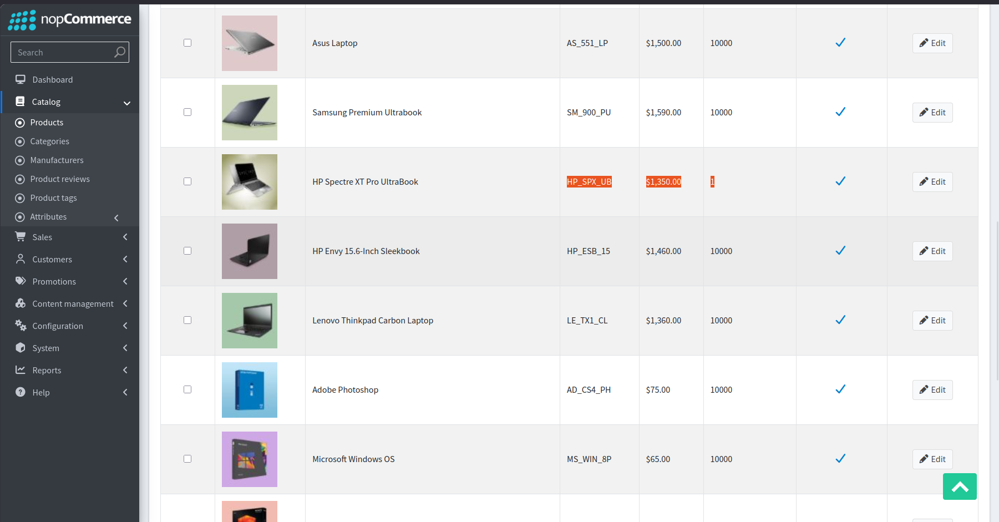
*Baseline: nopCommerce Admin showing HP Spectre XT Pro UltraBook (SKU: HP\_SPX\_UB) with StockQuantity = 1 before the test.*

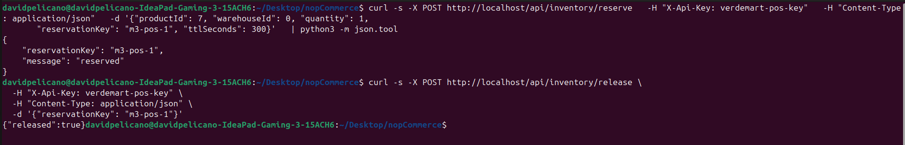
*POS channel wins the last unit (HTTP 200 `reserved`). After the test, release returns `{"released":true}` — the reservation lifecycle completes correctly.*

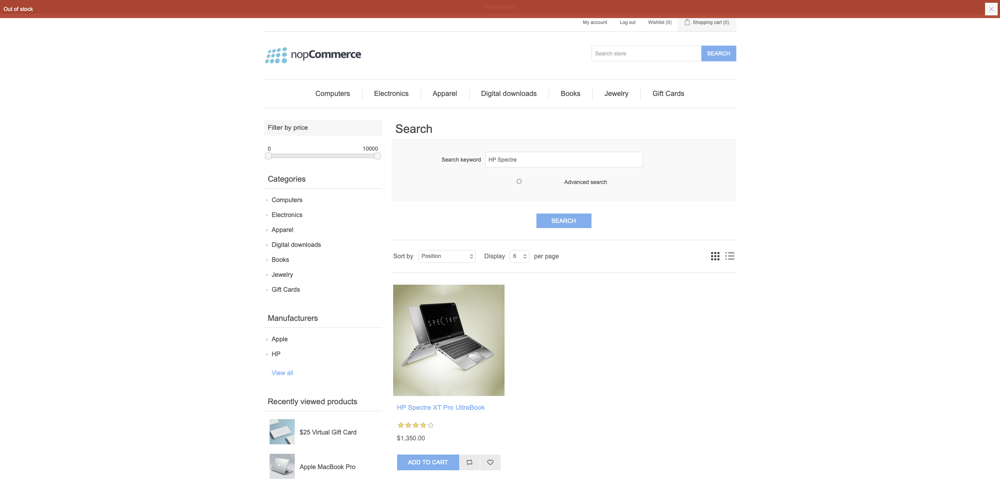
*Web channel blocked at the product page ("Out of stock") while the POS reservation is active. Effective availability = StockQuantity(1) − active\_reservations(1) = 0 propagates to the display layer.*

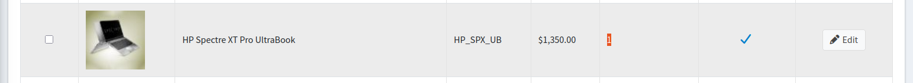
*After POS release: StockQuantity restored to 1 in the database. Stock was decremented at reserve time and returned at release time — the reserve/release lifecycle completed correctly. Zero oversell confirmed.*

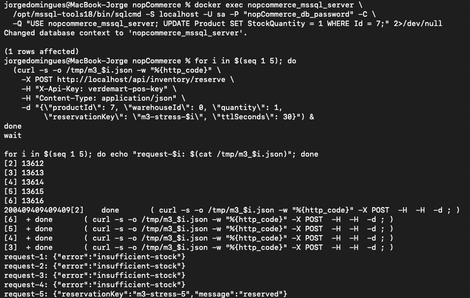
*Scenario B: 5 simultaneous POS reserve requests with StockQuantity = 1. Exactly 1 request wins (HTTP 200). The remaining 4 return HTTP 409 `{"error":"insufficient-stock"}`. StockQuantity never goes negative.*

**Note:** The rejection happens at the product listing level (before cart), not just at checkout confirm. The `AllocationGate` effective availability (`StockQuantity − SUM(active reservations)`) propagates to the product display, providing an earlier and more visible signal to the web customer than a late checkout failure.

### Pass criteria

- `StockQuantity` remains ≥ 0 at all points during and after the test. ✅ (both scenarios confirmed)
- Exactly 1 request succeeds (HTTP 200) in both scenarios. ✅ (both scenarios confirmed)
- All losers receive their rejection response synchronously, within the same request cycle. ✅ (both scenarios confirmed)

---

## M4 — QAS-5 (Carrier): Status Change Propagation via WireMock

### Mechanism under test

`CarrierStatusPollerTask` (ADR-008) runs every 30 seconds as an `IScheduleTask`. On each tick it calls `GET /api/shipments/{ExternalShipmentId}/status` on WireMock for each open shipment. WireMock is configured with a per-shipment state machine (`Started → IN_TRANSIT → OUT_FOR_DELIVERY → DELIVERED`): each call advances the state by one step. On detecting that the returned status differs from `Shipment.ExternalShippingStatus`, the task updates the column and enqueues a customer notification email in a single DB transaction.

**QAS-5 response measure:** carrier tracking status visible in nopCommerce within 30 seconds of the change occurring in the carrier system; email queued within the same window.

### Pre-conditions

- A nopCommerce `Shipment` must have `ExternalShipmentId` populated. This happens automatically after an order is placed, the admin creates a shipment for it, `ShipmentSentEventConsumer` writes a `carrier.booking.requested` outbox row, and `CarrierBookingConsumer` calls WireMock and stores the returned `WIRE-XXXXX` identifier.
- Plugin `Nop.Plugin.Shipping.CarrierTracking` must be installed and active in `/Admin/Plugin/List`.

Verify a shipment is ready:

```bash
docker exec nopcommerce_mssql_server \
  /opt/mssql-tools18/bin/sqlcmd \
  -S localhost -U sa -P "nopCommerce_db_password" -C \
  -Q "USE nopcommerce_mssql_server;
      SELECT TOP 3 s.Id, s.OrderId, s.ExternalShipmentId, s.ExternalShippingStatus
      FROM Shipment s
      WHERE s.ExternalShipmentId IS NOT NULL
      ORDER BY s.Id DESC;" 2>/dev/null
```

### Procedure

**Step 1 — Record T₀ and current WireMock state:**

```bash
echo "T0: $(date '+%H:%M:%S')"
curl -s http://localhost:8090/__admin/scenarios \
  | python3 -c "import sys,json; s=json.load(sys.stdin); \
    [print(sc['name'], '->', sc['state']) for sc in s['scenarios']]"
```

**Step 2 — Poll nopCommerce for status change every 5 seconds:**

```bash
SHIPMENT_ID="WIRE-XXXXX"   # replace with actual ExternalShipmentId
for i in $(seq 1 12); do
  sleep 5
  result=$(docker exec nopcommerce_mssql_server \
    /opt/mssql-tools18/bin/sqlcmd \
    -S localhost -U sa -P "nopCommerce_db_password" -C \
    -Q "USE nopcommerce_mssql_server;
        SELECT ExternalShippingStatus, LastStatusOccurredAtUtc
        FROM Shipment WHERE ExternalShipmentId = '$SHIPMENT_ID';" 2>/dev/null \
    | grep -v "^$\|Changed\|rows\|---\|COLUMN\|ExternalShipping")
  echo "$((i * 5))s: $result"
done
```

Record the elapsed time when `ExternalShippingStatus` first changes.

**Step 3 — Confirm email was queued:**

```bash
docker exec nopcommerce_mssql_server \
  /opt/mssql-tools18/bin/sqlcmd \
  -S localhost -U sa -P "nopCommerce_db_password" -C \
  -Q "USE nopcommerce_mssql_server;
      SELECT TOP 3 Id, Subject, CreatedOnUtc
      FROM QueuedEmail
      ORDER BY CreatedOnUtc DESC;" 2>/dev/null
```

### Results — Run 2026-05-31 (T₀ 15:54:21)

Shipment `WIRE-15655` (Order #18). Times below are the server-side `LastStatusOccurredAtUtc` values (UTC).

| Status transition | T₀ | T_detected | Elapsed | ≤ 30 s? |
| --- | --- | --- | --- | --- |
| Started → IN_TRANSIT | 14:54:21 (T₀, scenario at `Started`) | 14:54:33 | 12 s | ✅ |
| IN_TRANSIT → OUT_FOR_DELIVERY | 14:54:33 | 14:55:03 | 30 s | ✅ |
| OUT_FOR_DELIVERY → DELIVERED | 14:55:03 | 14:55:33 | 30 s | ✅ |

**Email evidence: `QueuedEmail` rows queued in the same second as each status write:**

| Id | Subject | CreatedOnUtc | Matches transition |
| --- | --- | --- | --- |
| 39 | Your order … has been shipped | 14:54:33 | IN_TRANSIT ✅ |
| 40 | Your order … has been shipped | 14:55:03 | OUT_FOR_DELIVERY ✅ |
| 41 | Your order … has been partially shipped | 14:55:33 | DELIVERED ✅ |

**Note — poller cadence:** The three transitions are spaced exactly 30 s apart, matching the `CarrierStatusPollerTask` 30 s poll interval. Because the poller's `GET` both advances the WireMock state machine and reads the new state within the same call, the status is written to nopCommerce on the very tick the change becomes visible; the 30 s poll interval is therefore the worst-case detection latency for an independent carrier-side change. The first transition surfaced 12 s after T₀ (the first poll tick following booking).

### Pass criteria

- Each status transition is detected and written to nopCommerce within 30 seconds of WireMock advancing state. The worst-case detection latency equals the poll interval (30 s); all three transitions detected within one poll interval.
- A `QueuedEmail` row is created within the same tick as the status update. Emails 39/40/41 timestamps match the status writes to the second.

---

## M5 — QAS-5 (Warehouse): OpenBoxes ISSUED State Propagation

### Mechanism under test

`OpenBoxesStatusPollerTask` (ADR-009) runs every 30 seconds as an `IScheduleTask`. On each tick it polls `GET /api/generic/shipment?status=ISSUED` on OpenBoxes. On detecting a fulfillment order in `ISSUED` state whose `referenceNumber` matches a nopCommerce `OrderGuid`, it creates a `Shipment` row, transitions the order status to `Complete`, and writes a `carrier.booking.requested` outbox row — all inside one DB transaction. No operator action in nopCommerce is required.

**QAS-5 response measure:** OpenBoxes fulfillment state visible in nopCommerce within 30 seconds of the change occurring in the warehouse system; email queued within the same window.

### Pre-conditions

- A stock movement must exist in OpenBoxes with a `description` field equal to a nopCommerce `OrderGuid`. This is created automatically by the bridge when an order is placed.
- Plugin `Nop.Plugin.Fulfillment.OpenBoxes` must be installed and active in `/Admin/Plugin/List`.

Identify the target order:

```bash
docker exec nopcommerce_mssql_server \
  /opt/mssql-tools18/bin/sqlcmd \
  -S localhost -U sa -P "nopCommerce_db_password" -C \
  -Q "USE nopcommerce_mssql_server;
      SELECT TOP 5 Id, OrderGuid, OrderStatusId, ShippingStatusId, CreatedOnUtc
      FROM [Order]
      ORDER BY CreatedOnUtc DESC;" 2>/dev/null
```

### Procedure

**Step 1 — Manually advance the OpenBoxes stock movement to ISSUED:**

In OpenBoxes (`http://localhost:8080/openboxes`), navigate to the stock movement whose name contains the `OrderGuid`. Use the OpenBoxes UI to advance the movement through its workflow until it reaches `ISSUED`. Record the exact time this is done (T₀).

**Step 2 — Record T₀:**

```bash
echo "T0: $(date '+%H:%M:%S')"
ORDER_GUID="xxxxxxxx-xxxx-xxxx-xxxx-xxxxxxxxxxxx"  # replace
```

**Step 3 — Poll nopCommerce order status every 5 seconds:**

```bash
for i in $(seq 1 12); do
  sleep 5
  result=$(docker exec nopcommerce_mssql_server \
    /opt/mssql-tools18/bin/sqlcmd \
    -S localhost -U sa -P "nopCommerce_db_password" -C \
    -Q "USE nopcommerce_mssql_server;
        SELECT o.OrderStatusId, o.ShippingStatusId,
               (SELECT COUNT(*) FROM Shipment s WHERE s.OrderId = o.Id) AS ShipmentCount
        FROM [Order] o WHERE o.OrderGuid = '$ORDER_GUID';" 2>/dev/null \
    | grep -v "^$\|Changed\|rows\|---\|COLUMN\|OrderStatus")
  echo "$((i * 5))s: $result"
done
```

Record the elapsed time when `OrderStatusId = 30` (Complete) and `ShipmentCount = 1`.

**Step 4 — Confirm the carrier booking outbox row was written:**

```bash
docker exec nopcommerce_mssql_server \
  /opt/mssql-tools18/bin/sqlcmd \
  -S localhost -U sa -P "nopCommerce_db_password" -C \
  -Q "USE nopcommerce_mssql_server;
      SELECT TOP 3 EventType, Status, CreatedAtUtc
      FROM OutboxMessage
      WHERE EventType = 'carrier.booking.requested'
      ORDER BY CreatedAtUtc DESC;" 2>/dev/null
```

### Results — Run 2026-05-31 (T₀ 16:29:15)

Order #19 (`OrderGuid = D3C0C3EC-8C73-4B26-BE8D-5C497AEFC350`), placed 15:27:49 UTC. The OpenBoxes outbound movement was advanced to `ISSUED` manually; the poller detected it on the next tick.

| Metric | QAS requirement | Result |
| --- | --- | --- |
| T₀ (ISSUED set in OpenBoxes) | — | ~15:29:15 UTC (order still Pending at poll +5/+10/+15 s) |
| T_detected (OrderStatusId = Complete) | — | 15:29:33 UTC (Shipment 9 + outbox row both stamped 15:29:33) |
| Elapsed | ≤ 30 s | ✅ ~18 s |
| Operator action in nopCommerce | 0 | ✅ 0 — poller created everything automatically |
| Shipment row created automatically | Yes | ✅ Shipment 9, `ExternalShipmentId = WIRE-62343` |
| `carrier.booking.requested` outbox row written | Yes | ✅ stamped 15:29:33.547, Status=1 (dispatched) |

**End-to-end cascade (no operator action at any step):** 

```
OpenBoxes ISSUED
    (M5 OpenBoxesStatusPollerTask)→ Order #19 Complete + Shipment 9 + carrier.booking.requested  [15:29:33]
         (CarrierBookingConsumer)→ WIRE-62343 booked, ShippingStatus → Shipped                    [15:29:43]
              (CarrierStatusPollerTask)→ IN_TRANSIT → OUT_FOR_DELIVERY → DELIVERED                 [→ 15:31:03]
```

Final state confirmed: Order #19 `OrderStatusId = 30` (Complete), `ShippingStatusId = 40` (Delivered); Shipment 9 `ExternalShippingStatus = DELIVERED`, DeliveryDateUtc 15:31:03.

### Pass criteria

- Order status transitions to Complete within 30 seconds of `ISSUED` being set in OpenBoxes. Satisfies QAS-5 warehouse clause. ✅ Complete in ~18 s.
- A `Shipment` row is created automatically by the poller. No admin action in nopCommerce is required. ✅ Shipment 9 created automatically.
- A `carrier.booking.requested` outbox row is written, which triggers the Iteration 4 carrier booking chain. ✅ Written at 15:29:33 and the chain ran through to Delivered.

---

## M6 — ADR-003: Idempotency Under Message Redelivery

### Mechanism under test

ADR-003 mandates at-least-once delivery with `OrderGuid` as the idempotency key. The bridge maintains a `processed_orders` SQLite table (`order_guid PRIMARY KEY`). Before calling OpenBoxes, it checks this table; if the `OrderGuid` is already present it acknowledges the message and skips the API call. This ensures that a redelivered message — from a broker restart, a consumer crash between processing and acknowledgement, or any at-least-once redelivery — does not create a duplicate stock movement in OpenBoxes.

### Procedure

**Step 1 — Identify an already-processed `OrderGuid`:**

```bash
docker exec verdemart_openboxes_bridge \
  sqlite3 /data/processed_orders.db \
  "SELECT order_guid, openboxes_fulfillment_id, processed_at_utc
   FROM processed_orders LIMIT 3;"
```

Record one `order_guid`.

**Step 2 — Record current OpenBoxes stock movement count (baseline).**

In OpenBoxes → Outbound → List Outbound Movements, count the entries.

**Step 3 — Re-publish the same message to the queue.**

In the RabbitMQ Management UI (`http://localhost:15672` → Queues → `verdemart.orders.openboxes` → Publish message), publish a JSON payload with the same `OrderGuid`:

```json
{
  "OrderId": 1,
  "OrderGuid": "xxxxxxxx-xxxx-xxxx-xxxx-xxxxxxxxxxxx",
  "CustomerId": 1,
  "OrderTotal": 100.00,
  "CreatedOnUtc": "2026-05-01T00:00:00Z",
  "Items": [{"ProductId": 4, "Sku": "AP_MBP_13", "Name": "Apple MacBook Pro", "Quantity": 1, "UnitPriceInclTax": 100.00}],
  "Version": 2
}
```

**Step 4 — Observe bridge logs:**

```bash
docker logs -f verdemart_openboxes_bridge 2>&1 | grep -E "already processed|Fulfillment created"
```

Expected: `OrderGuid=... already processed — ack and skip`

**Step 5 — Confirm OpenBoxes stock movement count is unchanged.**

### Results — Run 2026-05-30 / 2026-05-31

**Message re-published via RabbitMQ Management:** `OrderGuid=f69aee6c-adbe-4f1a-a3c7-7490ce5e5a93` (originally fulfilled in M1).

**Bridge log:**
```
OrderGuid=f69aee6c-adbe-4f1a-a3c7-7490ce5e5a93 already processed — ack and skip
```

| Metric | Expected | Result |
| --- | --- | --- |
| Bridge log entry | `already processed — ack and skip` | ✅ Exact match |
| New stock movements created in OpenBoxes | 0 | ✅ 0 — OpenBoxes API not called |
| Message acknowledged (queue returns to 0) | Yes | ✅ ACK'd immediately |

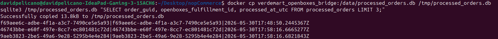
*Bridge's local SQLite `processed_orders` table. Each row is an OrderGuid the bridge has already fulfilled in OpenBoxes. Before any OpenBoxes call, the bridge checks this table.*

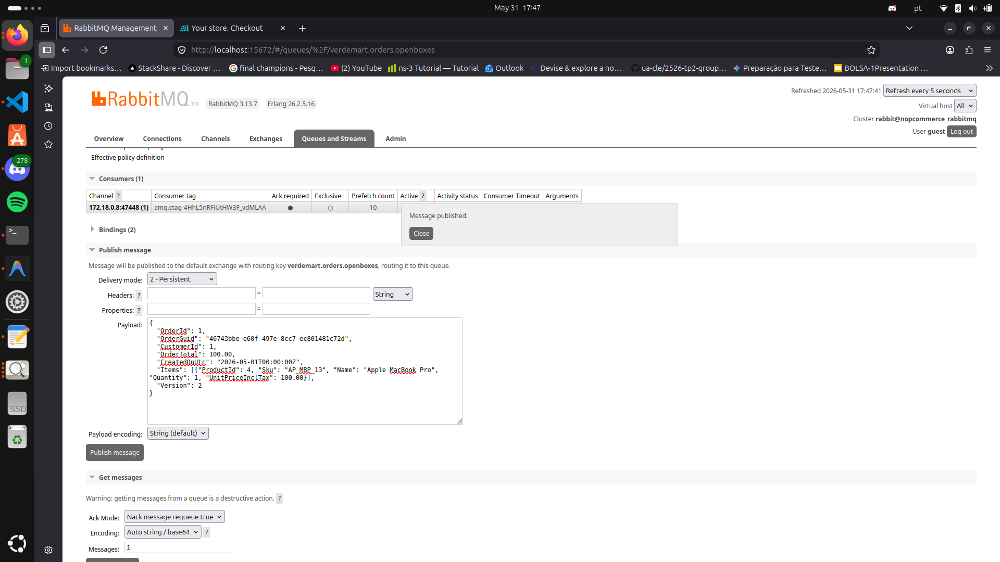
*Duplicate message published via RabbitMQ Management UI with the same OrderGuid (`f69aee6c...`). Delivery mode 2 - Persistent. The bridge consumed it immediately — queue depth returned to 0.*

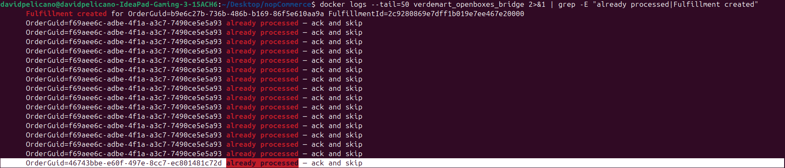
*Bridge logs confirming the duplicate was detected and silently discarded. The OpenBoxes API was never called. The message was ACK'd immediately.*

### Pass criteria

The duplicate message is silently acknowledged with no side effect. The OpenBoxes stock movement count is unchanged. ✅ ADR-003 at-least-once + idempotent consumer guarantee validated.

---

## Summary

| ID | QAS | Response measure | Pass criterion |
| --- | --- | --- | --- |
| M1 | QAS-1 + QAS-4 | Zero lost; drain ≤ 60 s; no operator action | Queue reaches N, drains to 0; N movements in OpenBoxes ≤ 60 s after bridge restart |
| M2 | QAS-3 | Checkout ≤ 3 s with bridge and OpenBoxes down | All checkouts complete under 3 s while surrounding systems are unavailable |
| M3 | QAS-2 | Zero oversell; one winner; same-cycle rejection | `StockQuantity` ≥ 0 always; exactly 1 × 200, remainder 409 or error |
| M4 | QAS-5 carrier | Status visible ≤ 30 s | Each WireMock transition detected and written ≤ 30 s |
| M5 | QAS-5 warehouse | ISSUED visible ≤ 30 s | Order = Complete and Shipment created ≤ 30 s after ISSUED; no operator action |
| M6 | ADR-003 | Zero duplicate fulfillments on redelivery | Dedup log entry; no new OpenBoxes stock movement |
