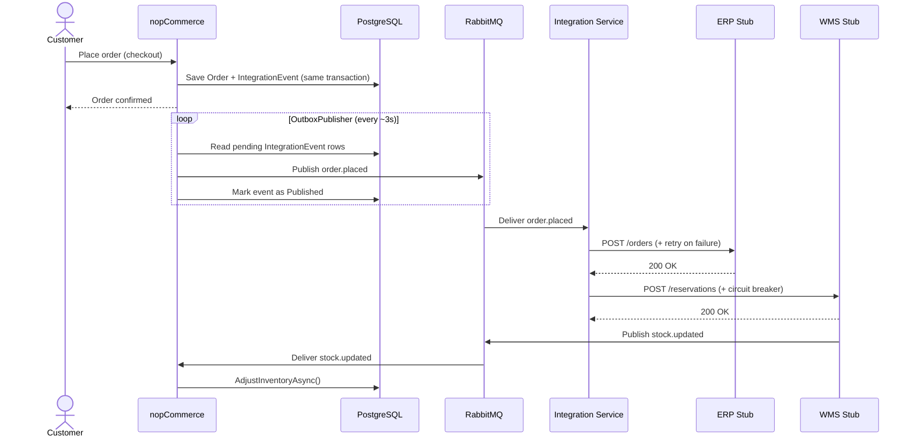
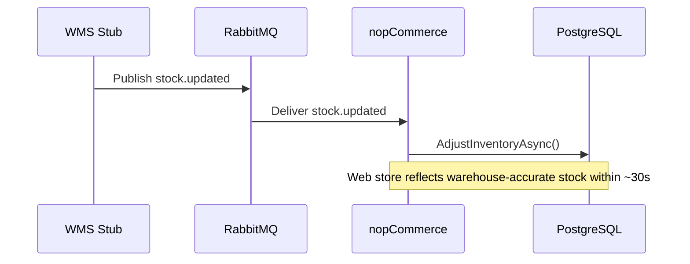

# Evolution Roadmap

**Owner: Duarte**  
**Scenario C — Omnichannel Commerce Core (VerdeMart Retail)**

---

## Starting Point and End Goal

**Current state:** nopCommerce operates as an isolated storefront — orders and stock are self-contained with no external system integration.

**Target state:** nopCommerce becomes the commerce core of a wider ecosystem: the ERP is notified on every order, the WMS is notified for stock reservation, and stock corrections flow back automatically. If the WMS fails, the commerce core continues accepting orders and reconciles when it recovers.

**What does not change:** the entire nopCommerce core (catalog, checkout, customers, payments) remains inside the monolith. The architectural problem is at the integration boundary. The evolution adds a thin integration layer around the monolith rather than decomposing it.

---

## Phase 0 — Baseline (Current State)

nopCommerce runs as a standalone ASP.NET Core application backed by PostgreSQL. The full order lifecycle — browse, cart, checkout, payment — is self-contained.

**Missing from the scenario:**
- No ERP is notified when an order is placed
- No WMS is contacted for stock reservation
- Stock quantities are only decremented by nopCommerce itself — no cross-channel correction
- No health endpoints or observability into integration state

---

## Phase 1 — Outbox and Message Backbone

**Goal:** decouple order placement from external system availability by introducing reliable event publication.

**Changes to nopCommerce:**
- Add `IntegrationEvent` entity and FluentMigrator migration
- Hook into `OrderProcessingService.PlaceOrderAsync()` — write `order.placed` to the outbox in the **same transaction** as the order
- Add `OutboxPublisherBackgroundService` — polls every ~3s, publishes pending events to RabbitMQ, marks as published
- Add `/integration/health` endpoint — pending outbox count, last publish timestamp

**Infrastructure:**
- RabbitMQ — exchange `verdemart.events` (topic), dead-letter exchange `verdemart.dlx` → queue `verdemart.dead-letter`

**Coexistence:** nopCommerce remains fully operational without the Integration Service — events accumulate in the outbox and are delivered when a consumer appears.

**QA addressed:** QA-1 — order placement is decoupled from broker and downstream availability.

**Critical constraint:** the outbox write must be atomic with the order write. A separate write after the transaction commits risks silent event loss on crash.

---

## Phase 2 — Fulfillment Coordination (Happy Path)

**Goal:** connect the message backbone to ERP and WMS so that a placed order triggers fulfillment and stock corrections flow back.

**New: Order Integration Service** (`services/order-integration-service/`)
- .NET Worker Service; consumes `order.placed` from RabbitMQ
- `ErpAdapter` — HTTP POST to ERP stub; exponential-backoff retry (Polly)
- `WmsAdapter` — HTTP POST to WMS stub; circuit breaker (Polly, opens after 3 failures)
- On WMS success: publishes `stock.updated` to RabbitMQ
- Exposes `/health` — circuit breaker state, pending message count

**New: ERP Stub** (`services/erp-stub/`)
- `POST /orders` — stores order confirmation in memory
- `POST /admin/mode` — toggle `normal` | `down`

**New: WMS Stub** (`services/wms-stub/`)
- `POST /reservations` — on success, publishes `stock.updated` to RabbitMQ
- `GET /stock/{productId}` — current warehouse stock level
- `POST /admin/mode` — toggle `normal` | `slow` | `down`

**Changes to nopCommerce:**
- Add `StockUpdateConsumerBackgroundService` — subscribes to `stock.updated`; calls `ProductService.AdjustInventoryAsync()`

**Happy path (UC1 — Buy-Online / Fulfill-Through-Another-Channel):**



**Cross-channel stock visibility (UC2):**



**QA addressed:** QA-2 — stock consistency across channels; UC1 and UC2 covered. QA-5 — ERP transient failure handled by `ErpAdapter` retry policy (3 attempts, exponential backoff).

---

## Phase 3 — Resilience and Pressure Point

**Goal:** make the WMS failure scenario visible, contained, and recoverable.

**Changes to Order Integration Service:**
- Circuit breaker on `WmsAdapter` is exercised under failure:
  - After 3 consecutive failures, circuit opens
  - While open: messages go to `verdemart.dead-letter` instead of retrying WMS
  - Transitions to half-open after a timeout; first success closes it
- Reconciliation loop — activates on half-open transition:
  - Drains `verdemart.dead-letter`, resubmits each `order.placed` to WMS
  - Publishes `stock.updated` for each successful reservation
  - Idempotent on `eventId` (UUID)

**New: Observability Dashboard** (`services/dashboard/`)
- Single-page HTML/JS app polling `/health` every 2s
- Displays live: circuit breaker state, WMS mode, outbox count, dead-letter depth
- Control buttons: flip WMS to `down` / `slow` / `normal` without touching the terminal

**Pressure point demo sequence:**
```
1. Operator sets WMS → DOWN via dashboard
2. Customers place N orders → confirmed instantly, outbox fills
3. Integration Service: WMS calls fail → circuit opens after 3rd failure → messages go to DLQ
4. Dashboard: circuit=OPEN, dlq_depth=N, wms_mode=down
5. Operator sets WMS → NORMAL via dashboard
6. Circuit: HALF-OPEN → first probe succeeds → CLOSED
7. Reconciliation loop drains DLQ → all N reservations sent → stock.updated published
8. Dashboard: circuit=CLOSED, dlq_depth=0
9. nopCommerce stock quantities correct
```

**QA addressed:** QA-1 (WMS down does not block orders), QA-3 (recovery after outage), QA-4 (degradation visible to operator).

---

## Risks and Validation

Main architectural risks are tracked in [`docs/architecture/risk-plan.md`](risk-plan.md). Summary:

| Risk | Severity | Mitigation |
|------|----------|------------|
| Outbox hook into `OrderProcessingService` breaks nopCommerce DI | HIGH | Feasibility spike (Week 1) before full implementation |
| Circuit breaker timing wrong — demo unconvincing | MEDIUM | Integration tests against real Docker Compose stack (Week 3–4) + demo rehearsal (Week 5) |
| Docker Compose startup order causes demo failure | LOW-MEDIUM | `depends_on: condition: service_healthy` + smoke test script |

---

## Evidence to Capture

The following measurements will be collected to support Part 2 evaluation and demonstrate quality attribute improvements:

| Metric | Target | How measured |
|--------|--------|--------------|
| Order acceptance rate during WMS failure | 100% — zero order failures attributable to WMS | Place N orders with WMS in `down` mode; count confirmed orders |
| Time from WMS recovery to DLQ fully drained | < 60 s | Timestamp WMS → `normal` transition; timestamp last `stock.updated` published from DLQ |
| Stock update lag (WMS event → nopCommerce web stock) | < 30 s | Trigger `stock.updated` from WMS stub; record elapsed time until nopCommerce product reflects new quantity |
| ERP retry recovery time | < 30 s after transient failure | Set ERP to `down` for 20 s; verify order appears in ERP; check retry log timestamps |
| Dashboard state refresh latency | < 5 s after circuit opens | Timestamp first WMS timeout; timestamp dashboard showing `OPEN` |
| Duplicate event protection | Zero duplicate ERP orders on DLQ drain | Drain DLQ after recovery; verify ERP has exactly N orders (not 2N) |

**Failure scenarios to document:**
- WMS permanently down (DLQ grows indefinitely — expected, not a bug)
- ERP returns 503 twice then recovers (retry backoff; order arrives on 3rd attempt)
- nopCommerce restarts mid-outbox flush (events re-published on restart — at-least-once, idempotency prevents duplicates)

---

## Known Limitations

| Limitation | Impact | Reason not addressed |
|------------|--------|----------------------|
| ERP has no circuit breaker or dead-letter queue | If ERP is permanently down, retry exhaustion loses the event | ERP failure is not the mandatory pressure point; adding DLQ for ERP would duplicate the WMS pattern without adding a new architectural lesson |
| Outbox polling interval is ~3 s | Up to 3 s latency between order placement and event publication | Acceptable for the scenario; reducing it would require push-based change data capture (CDC), which is out of scope |
| WMS and ERP stubs are in-memory | A stub restart loses all recorded reservations and orders | Stubs are demonstration fixtures, not production services; persistence would add complexity without architectural value |
| No inter-service authentication | Internal services communicate without auth tokens | All services run on a private Docker network; adding auth (e.g., mTLS) is a cross-cutting concern orthogonal to the reliability patterns being demonstrated |
| Dashboard is poll-based (every 2 s) | State transitions may appear with up to 2 s delay | Simpler than WebSocket push; sufficient for demo purposes |

---

## Transition Constraints

| Constraint | Applies to | Reason |
|------------|-----------|--------|
| nopCommerce must remain fully functional if Integration Service is not running | Phase 1 → 3 | Outbox buffers events; customer experience must not depend on downstream availability |
| No shared database across service boundaries | Phase 2 → 3 | ERP and WMS stubs have their own state; nopCommerce PostgreSQL is never accessed externally |
| Outbox write must be atomic with the order write | Phase 1 → 3 | A crash between order save and event write produces a silent lost event |
| `eventId` must be propagated end-to-end | Phase 2 → 3 | Required for idempotent reconciliation and log correlation across service boundaries |
| Integration Service must not hold shared mutable state in memory | Phase 2 → 3 | Multiple instances must be possible; state belongs in RabbitMQ (DLQ) or the circuit breaker policy |

---

## What Remains Inside the Monolith

| Concern | Justification |
|---------|---------------|
| Order lifecycle (placement, payment, status) | Core domain — not decomposed |
| Product catalog and pricing | Core domain — not decomposed |
| Customer management | Core domain — not decomposed |
| Stock quantity (web-visible) | Owned by Catalog context; corrected via events, not direct writes |
| Outbox table | Must share the order's transaction scope — cannot be external |
| Stock update consumer | Applies corrections to nopCommerce-owned data; must live inside the monolith |

The integration service boundary is the only extracted boundary. Everything else stays in the monolith because the architectural problem is at the integration edge, not inside the commerce domain.
