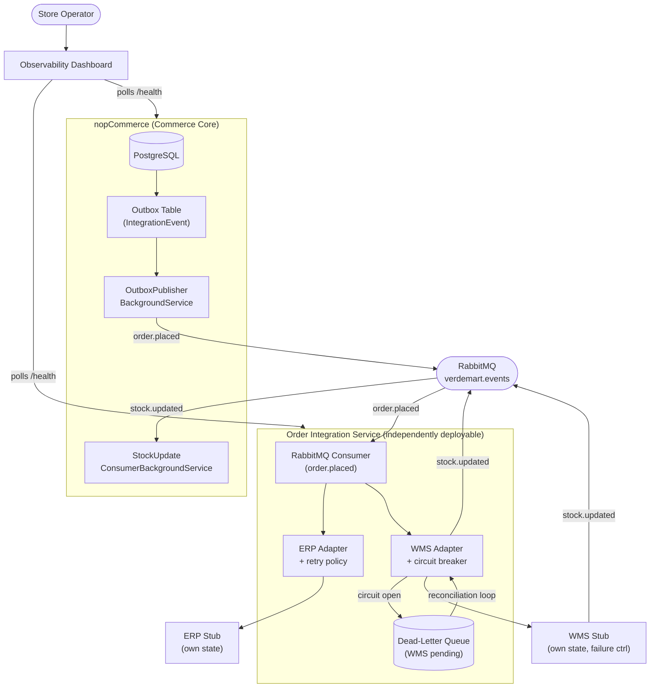
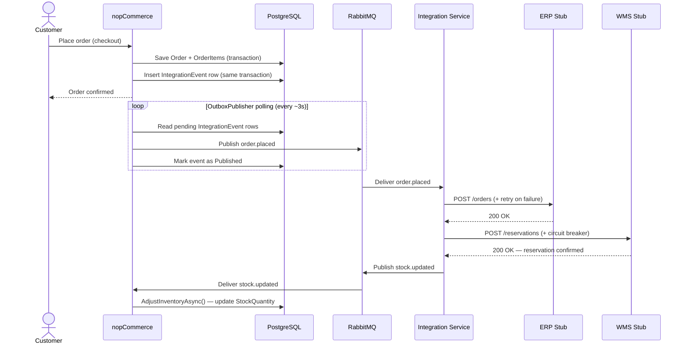
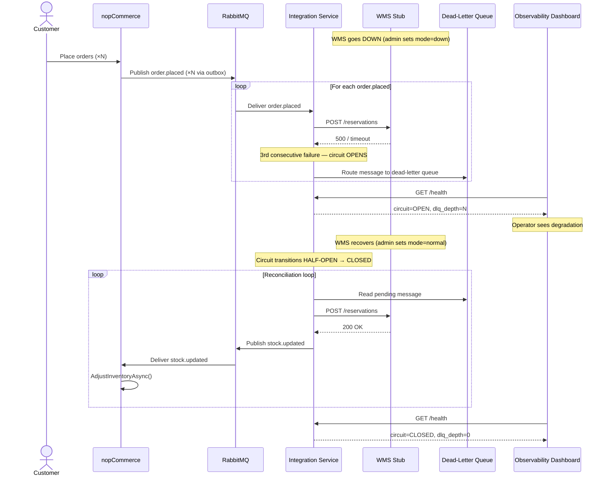
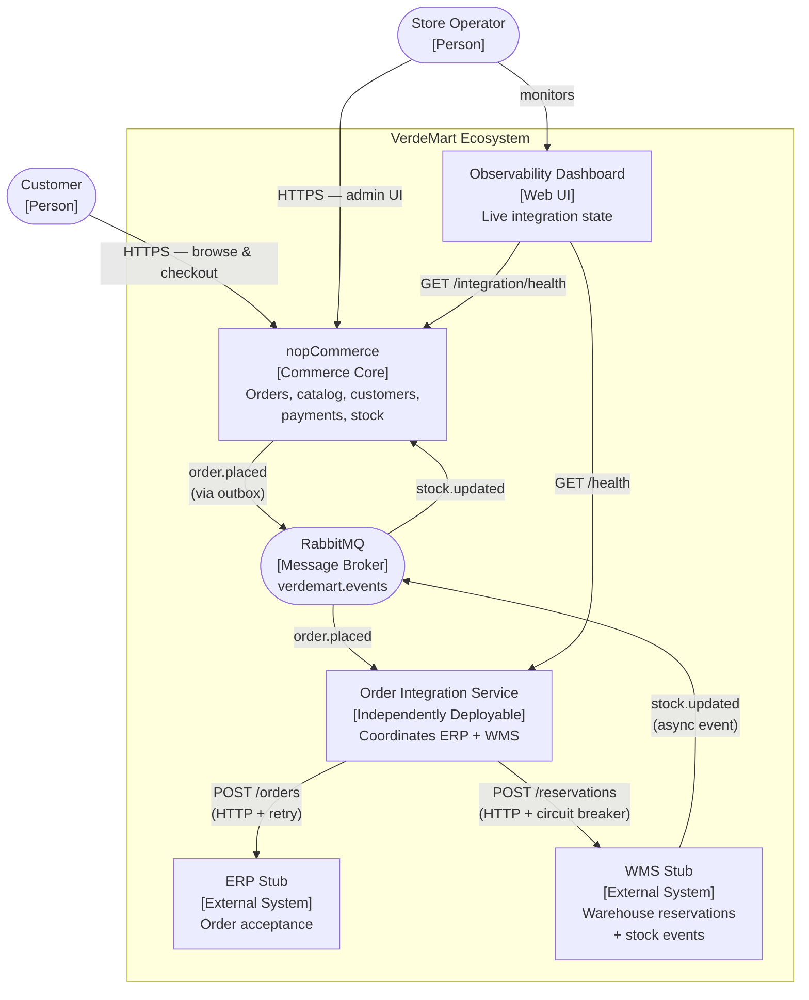

# Target Architecture

**Scenario C — Omnichannel Commerce Core (VerdeMart Retail)**

## 1. Architecture Overview

nopCommerce evolves from an **isolated web storefront** into the **commerce core** of a wider operational ecosystem. The monolith is minimally modified — only the integration boundary is added. Surrounding systems communicate through a message broker (RabbitMQ) rather than direct calls.



## 2. Component Responsibilities

### nopCommerce (modified monolith)
- Owns: Order lifecycle, customer data, product catalog, payment processing, stock quantities
- **New**: `IntegrationEvent` outbox table (FluentMigrator migration)
- **New**: `OutboxPublisherBackgroundService` — polls pending outbox rows, publishes to RabbitMQ `verdemart.events` exchange, marks as published
- **New**: `StockUpdateConsumerBackgroundService` — subscribes to `stock.updated` routing key, calls `ProductService.AdjustInventoryAsync()`
- **New**: `/integration/health` — reports pending outbox count, last publish time

### Order Integration Service (new, independently deployable)
- Owns: Coordination between nopCommerce events and external operational systems
- Consumes `order.placed` from RabbitMQ
- Forwards to ERP stub (retry with exponential backoff via Polly)
- Forwards to WMS stub (circuit breaker via Polly — opens after 3 consecutive failures)
- When circuit breaker opens: routes message to dead-letter queue
- Reconciliation loop: when circuit breaker half-opens, drains dead-letter queue
- Publishes `stock.updated` to RabbitMQ after WMS confirms reservation
- Exposes `/health` (circuit breaker state, pending messages)

### ERP Stub (`services/erp-stub/`)
- Simulates ERP order acceptance
- `POST /orders` — stores confirmation in-memory
- `POST /admin/mode` — toggle `normal` | `down` for demo

### WMS Stub (`services/wms-stub/`)
- Simulates warehouse reservation
- `POST /reservations` — accepts reservation; on success, publishes `stock.updated` to RabbitMQ
- `GET /stock/{productId}` — returns current warehouse stock
- `POST /admin/mode` — toggle `normal` | `slow` | `down` for demo pressure point

### Observability Dashboard (`services/dashboard/`)
- Polls `/health` from Integration Service and nopCommerce every 2s
- Shows live: circuit breaker state, WMS mode, pending outbox count, dead-letter queue depth
- Demo control buttons: flip WMS to down/slow/normal

## 3. Data Ownership

| Data | Owner | Shared? |
|------|-------|---------|
| Orders, order items | nopCommerce PostgreSQL | No — integration only via events |
| Product catalog, stock quantities | nopCommerce PostgreSQL | No — WMS pushes updates via events |
| Customer data | nopCommerce PostgreSQL | No |
| Fulfillment confirmations | ERP stub (in-memory) | No |
| Warehouse reservations | WMS stub (in-memory) | No |
| Integration events (outbox) | nopCommerce PostgreSQL | No — internal only |

**No shared database** across the extracted integration service boundary.

## 4. Synchronous vs Asynchronous Interactions

| Interaction | Pattern | Justification |
|-------------|---------|---------------|
| Order placement → outbox write | Synchronous (same DB transaction) | Atomicity: order and event written together |
| Outbox → RabbitMQ | Asynchronous (background service, polling) | Decouples order placement from broker availability |
| RabbitMQ → Integration Service | Asynchronous (push consumer) | Integration service processes at own pace |
| Integration Service → ERP | Synchronous HTTP + retry | Simple; ERP must confirm before moving on |
| Integration Service → WMS | Synchronous HTTP + circuit breaker | Failure must be detected per-call to open circuit |
| WMS → stock.updated event | Asynchronous (push to RabbitMQ) | Cross-channel visibility decoupled from order flow |
| RabbitMQ → nopCommerce (stock consumer) | Asynchronous | nopCommerce applies stock updates in background |

## 5. Reliability Decisions

| Decision | Mechanism | What it handles |
|----------|-----------|-----------------|
| Outbox pattern | DB table + background publisher | Guarantees at-least-once delivery even if RabbitMQ is temporarily down |
| Retry with backoff | Polly `RetryPolicy` on ERP adapter | Transient ERP failures |
| Circuit breaker | Polly `CircuitBreakerPolicy` on WMS adapter | WMS prolonged unavailability — prevents cascade |
| Dead-letter queue | RabbitMQ DLX | Preserves unprocessable messages for reconciliation |
| Reconciliation loop | Integration Service background loop | Drains DLQ after WMS recovery |

## 6. Cross-Cutting Concerns

- **Observability**: Structured logging (Serilog) with `correlationId` propagated from `order.placed` event through all downstream systems. Dashboard visualises live state.
- **Idempotency**: `IntegrationEvent.EventId` (UUID) used as RabbitMQ message ID; Integration Service deduplicates on `eventId` to prevent double-processing on retry.
- **Traceability**: Each integration event carries `orderId` + `eventId`; logs in Integration Service correlate WMS/ERP calls to originating order.

## 7. Runtime Sequence — Happy Path (Use Case 1: Buy-Online / Fulfill-Through-Another-Channel)



## 8. Runtime Sequence — Pressure Point (WMS Unavailable → Recovery)



## 10. Evolution Path (Current → Target)

```
Step 1  Add IntegrationEvent table migration + outbox writer hook in OrderProcessingService
Step 2  Add OutboxPublisherBackgroundService (polls + publishes to RabbitMQ)
Step 3  Build Order Integration Service skeleton + RabbitMQ consumer
Step 4  Build ERP stub + WMS stub (Dockerized)
Step 5  Add ERP adapter + retry policy in Integration Service
Step 6  Add WMS adapter + circuit breaker + dead-letter + reconciliation
Step 7  Add StockUpdateConsumerBackgroundService in nopCommerce
Step 8  Add observability dashboard + health endpoints
Step 9  Demonstrate pressure point: WMS → down → orders queue → WMS up → reconcile
```

## 11. What Remains Inside the Monolith and Why

The entire nopCommerce core (catalog, orders, customers, payments, checkout) remains inside the monolith because:
- It is already well-factored as a modular monolith with a clean service layer
- The architectural problem is at the **integration boundary**, not inside the commerce domain
- Rewriting the monolith would not satisfy the "selective evolution" constraint and would produce an inflated, undefensible design
- The outbox pattern + background consumers are standard monolith-friendly patterns that require minimal invasive changes

## 9. C4 — Context Level


